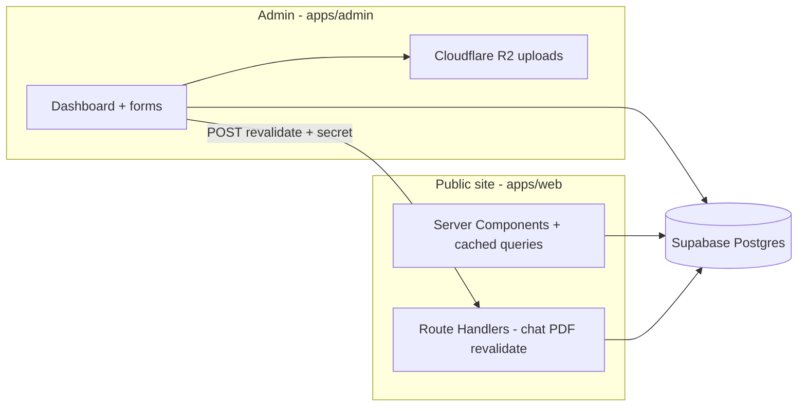

# Portfolio — khubaibqaiser.com

Production-grade monorepo for **[Khubaib Qaiser](https://khubaibqaiser.com)**’s personal site: a public Next.js portfolio, a separate admin CMS, shared packages, and documented infrastructure choices. The focus is a **maintainable, observable system**, not a static brochure site.

---

## Overview

| Area | Notes |
|------|-------|
| **Monorepo** — Turborepo + pnpm workspaces | Multiple apps from one repo with shared packages |
| **Next.js App Router + RSC** — cached server data, minimal client JS | Modern React architecture, performance-conscious |
| **Supabase (Postgres + Auth + RLS)** | Real database, not static JSON; content is editable and protected |
| **Split deploys on Vercel** — web, admin, Storybook as separate projects | Same repo, independent release surfaces |
| **Type-safe env** — `@t3-oss/env-nextjs` | Production hygiene; fails fast on misconfiguration |
| **CI** — lint, typecheck, build, PR Lighthouse | Quality gate before merge |
| **Sentry + Vercel Analytics / Speed Insights** | Operational awareness |

**Live:** [khubaibqaiser.com](https://khubaibqaiser.com) · **Admin:** [admin.khubaibqaiser.com](https://admin.khubaibqaiser.com) · **Storybook:** [storybook.khubaibqaiser.com](https://storybook.khubaibqaiser.com)

---

## Architecture

### Design choices

- **Vercel for hosting:** Best-in-class Next.js integration, preview deployments, edge caching, and minimal ops for a portfolio-sized team (one person). Alternatives (e.g. raw GCP/AWS containers) trade DX and iteration speed for control we do not need here.
- **Supabase for data and auth:** Postgres is the source of truth for structured content; Row Level Security and Supabase Auth align admin-only writes with **defense in depth** (not “security only in the Next.js layer”).
- **Cloudflare R2 for media:** S3-compatible object storage with a **public URL** pattern suitable for images/assets uploaded from the admin app; keeps large blobs out of Postgres.
- **Optional Redis (Upstash):** Intended for **rate limiting**, short-lived caching, and similar cross-request state that does not belong in Postgres. Serverless-friendly; same Redis family as production systems at scale.
- **Groq + Vercel AI SDK for chat:** Inference is delegated to a hosted LLM API; the app builds a **grounded system prompt** from Supabase-backed profile data so the assistant stays on-topic.

### Scope & boundaries

- **Multi-vendor stack:** Services are **best-of-breed SaaS** where each piece earns its place. Consolidating on a single cloud is a separate product/ops decision.
- **RAG / vector search:** The database includes a **pgvector-backed `content_embeddings` table** (migrations + types) as a **forward-looking** hook for retrieval-augmented chat. The current chat route uses a **curated system prompt** built from structured Supabase queries, not live embedding retrieval (see chat route for behavior).

### High-level data flow



Content changes in the admin app trigger **on-demand revalidation** on the public app (`POST /api/revalidate` with a shared secret) so `unstable_cache` / tag-based caches refresh without a full redeploy.

---

## Repository structure

```
portfolio-v2/
├── apps/
│   ├── web/                 # Public site — Next.js, API routes, chat, PDF
│   └── admin/               # CMS — auth-gated editors, R2 uploads, revalidation hooks
├── packages/
│   ├── shared/              # Types, Zod schemas, Supabase queries, constants
│   ├── ui/                  # Design system + Storybook
│   └── eslint-config/      # Shared ESLint
├── supabase/migrations/     # SQL schema, RLS, extensions (e.g. pgvector)
├── .github/workflows/       # CI (+ Lighthouse on PRs for web)
├── turbo.json
└── pnpm-workspace.yaml
```

| Package | NPM name | Role |
|---------|----------|------|
| `apps/web` | `@portfolio/web` | Public portfolio (port **3000**) |
| `apps/admin` | `@portfolio/admin` | Admin dashboard (port **3001**) |
| `packages/shared` | `@portfolio/shared` | Shared types, validation, data access |
| `packages/ui` | `@portfolio/ui` | UI primitives, Storybook (port **6006**) |
| `packages/eslint-config` | `@portfolio/eslint-config` | Shared lint rules |

---

## Technology stack (accurate to dependencies)

### Core

| Layer | Choice |
|-------|--------|
| Framework | **Next.js 16** (App Router, React Server Components) |
| UI | **React 19**, **Tailwind CSS v4** |
| Language | **TypeScript** (strict) |
| Monorepo | **Turborepo** + **pnpm** workspaces |
| Design system | **`@portfolio/ui`** — Radix-based primitives, Storybook |

### Public site (`apps/web`)

| Concern | Implementation |
|---------|----------------|
| Animation / motion | Framer Motion, GSAP (ScrollTrigger) |
| Smooth scrolling | Lenis (via shared UI wrapper) |
| Theming | `next-themes` (light / dark / system) |
| Command palette | `cmdk` |
| AI assistant | **Vercel AI SDK** + **Groq** (Llama family models; fallback on provider rate limits) |
| Resume PDF | `@react-pdf/renderer` (server route) |
| Content | Server-side fetch from Supabase + Next **tagged cache** + revalidation |
| Observability | **Sentry** (`@sentry/nextjs`), **Vercel Analytics**, **Speed Insights** |

### Admin (`apps/admin`)

| Concern | Implementation |
|---------|----------------|
| Forms | **React Hook Form** + **Zod** (`@hookform/resolvers`) |
| Auth | **Supabase Auth** (e.g. Google OAuth + magic link) — session enforced in **middleware** with an **email allowlist** aligned to RLS |
| Media | **AWS SDK** → **Cloudflare R2** (S3-compatible) |

### Infrastructure & integrations

| Service | Role | Notes |
|---------|------|--------|
| **Vercel** | Hosting, CDN, previews | Three projects: web, admin, Storybook (`packages/ui`) |
| **Supabase** | Postgres, Auth, RLS | Single project; migrations in `supabase/migrations/` |
| **Cloudflare R2** | Object storage for uploads | Configured in admin env; public asset URLs |
| **Groq** | LLM API for chat | Optional `GROQ_API_KEY` on web |
| **Upstash Redis** | Rate limits / cache (planned) | Env placeholders; use when wired in API routes |
| **Resend** | Transactional email (contact) | Env supported; contact route has staged enhancements |
| **Cloudflare Turnstile** | Bot protection (contact) | Schema/env ready; integration staged with form hardening |
| **PostHog** | Product analytics (optional) | Env keys; wire when you want full event analytics |
| **GitHub Actions** | CI | Lint, typecheck, build; Lighthouse on pull requests for web |

---

## Security

- **Security headers** on the public app (HSTS, `X-Frame-Options`, `Referrer-Policy`, etc.) — see [`apps/web/next.config.ts`](apps/web/next.config.ts).
- **Secrets:** Revalidation uses a **shared secret** between admin and web; never expose service role keys to the browser.
- **Admin access:** Middleware + Supabase session + **allowlisted emails** + RLS policies — multiple layers, not a single gate.
- **AI chat:** Prompt is built from **your** published Supabase content; no anonymous training story — third-party inference still applies (see Groq terms).

---

## Local development

### Prerequisites

- **Node.js** ≥ 20 (CI uses 22)
- **pnpm** 10.x — `corepack enable` matches [`package.json`](package.json) `packageManager`

### Install

```bash
git clone https://github.com/khubaibqaiser/portfolio-v2.git
cd portfolio-v2
pnpm install
```

### Environment

Copy examples and fill values:

```bash
cp apps/web/.env.example apps/web/.env.local
cp apps/admin/.env.example apps/admin/.env.local
```

The web app validates env at runtime via **`@t3-oss/env-nextjs`**. For CI or first boot without all optional keys:

```bash
export SKIP_ENV_VALIDATION=1
```

### Commands

| Command | Description |
|---------|-------------|
| `pnpm dev` | All dev tasks (Turborepo) |
| `pnpm dev:web` | Portfolio only — http://localhost:3000 |
| `pnpm dev:admin` | Admin only — http://localhost:3001 |
| `pnpm storybook` | Design system — http://localhost:6006 |
| `pnpm build` | Production build (cached) |
| `pnpm lint` / `pnpm typecheck` | Quality gates |
| `pnpm format` / `pnpm format:check` | Prettier |
| `pnpm db:types` | Regenerate Supabase TypeScript types (requires Supabase CLI linked project) |
| `pnpm db:reset` | Local DB reset via Supabase CLI |

---

## Deployment (Vercel)

Three **separate** Vercel projects, one repo:

| Project | Root | Output / notes | Typical domain |
|---------|------|----------------|----------------|
| Portfolio | `apps/web` | Next default | `khubaibqaiser.com` |
| Admin | `apps/admin` | Next default | `admin.khubaibqaiser.com` |
| Storybook | `packages/ui` | `pnpm build-storybook` → `storybook-static` | `storybook.khubaibqaiser.com` |

For Storybook, set the framework preset to **Other** (static export). Inject env vars per project from the Vercel dashboard (web and admin need their respective secrets).

---

## CI pipeline

On every push to `main` and every PR:

1. **Lint** — ESLint across packages  
2. **Typecheck** — `tsc --noEmit`  
3. **Build** — full Turborepo build with `SKIP_ENV_VALIDATION=1` and GitHub **Variables** for public Supabase URL/anon key and site URL  

**Pull requests** additionally run **Lighthouse CI** on the built web app (see [`apps/web/lighthouserc.json`](apps/web/lighthouserc.json)).

---

## Environment variables (reference)

Details live in **`apps/web/.env.example`** and **`apps/admin/.env.example`**. Summary:

**Web — required for a full production build:** `NEXT_PUBLIC_SUPABASE_*`, `SUPABASE_SERVICE_ROLE_KEY`, `NEXT_PUBLIC_SITE_URL`, `REVALIDATE_SECRET`.

**Web — optional:** `GROQ_API_KEY`, `GITHUB_TOKEN`, Upstash, Resend, Turnstile, PostHog, Sentry, Cloudflare Workers AI (embeddings pipeline when implemented).

**Admin — required:** `NEXT_PUBLIC_SUPABASE_URL`, `NEXT_PUBLIC_SUPABASE_ANON_KEY`, `NEXT_PUBLIC_WEB_URL`, `REVALIDATE_SECRET` (must match web).

**Admin — media:** `R2_*` variables for Cloudflare R2 (see admin `.env.example`).

---

## Performance & quality targets

Targets are **goals** for the public site (adjust as content grows):

| Metric | Target |
|--------|--------|
| TTFB | &lt; 100ms (edge-cached where applicable) |
| LCP | &lt; 2.5s (real-world networks vary) |
| Lighthouse (CI) | Tracked on PRs — aim for strong scores across categories |

---

## Roadmap

Items that improve production readiness without changing the core architecture:

- **Chat:** Application-level rate limiting (e.g. Upstash) + `Retry-After` UX  
- **Contact:** Turnstile verification, Resend delivery, optional Supabase persistence  
- **RAG:** Populate `content_embeddings` and retrieve relevant chunks in the chat route  
- **Analytics:** Full PostHog instrumentation where product questions matter  

---

## Author

**Khubaib Qaiser** — Senior Software Engineer  

- Site: [khubaibqaiser.com](https://khubaibqaiser.com)  
- GitHub: [github.com/khubaibqaiser](https://github.com/khubaibqaiser)  
- LinkedIn: [linkedin.com/in/khubaib-qaiser](https://linkedin.com/in/khubaib-qaiser)  

---

## License

Proprietary. All rights reserved. See [LICENSE](./LICENSE).
