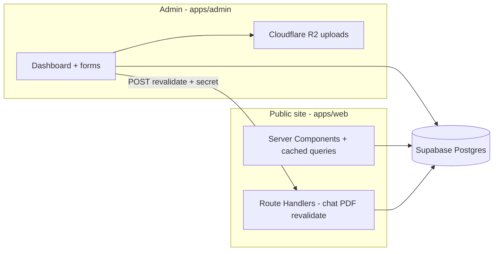

# Portfolio — khubaibqaiser.com

Source for **[Khubaib Qaiser](https://khubaibqaiser.com)**’s site: **Turborepo** with a public Next.js app (`apps/web`), an admin app (`apps/admin`), and shared packages. Content lives in **Supabase**; media uploads go to **Cloudflare R2**.

---

## Overview

| Area | Notes |
|------|-------|
| **Monorepo** — Turborepo + pnpm | One repo, shared packages |
| **Next.js App Router + RSC** | Server data, small client bundles where it matters |
| **Supabase** — Postgres, Auth, RLS | Content and auth in one place |
| **Vercel** | Web, admin, and Storybook deployed as separate projects |
| **Env** | `apps/web/.env.example` and `apps/admin/.env.example` — [Environment setup](#environment-setup) |
| **CI** | Lint, typecheck, build; Lighthouse on PRs for web |
| **PostHog**, **Vercel Analytics / Speed Insights** | Product analytics, errors, alerts; aggregate traffic / Web Vitals |

**Links:** [khubaibqaiser.com](https://khubaibqaiser.com) · [admin.khubaibqaiser.com](https://admin.khubaibqaiser.com) · [storybook.khubaibqaiser.com](https://storybook.khubaibqaiser.com)

---

## Architecture

### Why these pieces

- **Vercel:** Hosts the Next apps; previews on every branch; little ops overhead for a solo maintainer.
- **Supabase:** Postgres holds structured content; Auth + RLS restrict who can write what (not only checks in Next.js).
- **Cloudflare R2:** S3-style storage for uploads from admin; files are served from a public URL, not stored as blobs in Postgres.
- **Groq + Vercel AI SDK:** Chat calls Groq’s API; the system prompt is built from profile data in Supabase so answers stay on topic.
- **Upstash Redis (optional):** Server-side sliding-window limits on `POST /api/chat` per client IP so the Groq key is not abused; skipped when env vars are unset (e.g. local dev).

### Scope

- **Stack:** Vercel, Supabase, Cloudflare, Groq, PostHog — separate vendors by design.
- **Embeddings / RAG:** Migrations define a `content_embeddings` table (pgvector). The chat route today does **not** query embeddings; it uses a fixed prompt built from Supabase tables. Embeddings are there for a future retrieval step.

### Data flow



After saves in admin, the app calls the public site’s `POST /api/revalidate` with a shared secret so tagged caches refresh without redeploying.

---

## Repository structure

```
portfolio-v2/
├── apps/
│   ├── web/                 # Public site — Next.js, API routes, chat, PDF
│   └── admin/               # CMS — auth, editors, R2, revalidation
├── packages/
│   ├── shared/              # Types, Zod, Supabase queries, constants
│   ├── ui/                  # Design system + Storybook
│   └── eslint-config/       # Shared ESLint
├── supabase/migrations/     # Schema, RLS, pgvector
├── .github/workflows/       # CI (+ Lighthouse on PRs for web)
├── turbo.json
└── pnpm-workspace.yaml
```

| Package | NPM name | Role |
|---------|----------|------|
| `apps/web` | `@portfolio/web` | Public site (port **3000**) |
| `apps/admin` | `@portfolio/admin` | Admin (port **3001**) |
| `packages/shared` | `@portfolio/shared` | Types, validation, data access |
| `packages/ui` | `@portfolio/ui` | UI kit, Storybook (**6006**) |
| `packages/eslint-config` | `@portfolio/eslint-config` | Shared ESLint |

---

## Technology stack

### Core

| Layer | Choice |
|-------|--------|
| Framework | **Next.js 16** (App Router, RSC) |
| UI | **React 19**, **Tailwind CSS v4** |
| Language | **TypeScript** (strict) |
| Monorepo | **Turborepo** + **pnpm** |
| Design system | **`@portfolio/ui`** — Radix, Storybook |

### Public site (`apps/web`)

| Concern | Implementation |
|---------|----------------|
| Motion | Framer Motion, GSAP (ScrollTrigger) |
| Scroll | Lenis (via shared UI wrapper) |
| Theme | `next-themes` |
| Command palette | `cmdk` |
| Chat | **Vercel AI SDK** + **Groq** (Llama models; second model if the first hits rate limits) |
| Resume PDF | `@react-pdf/renderer` (route handler) |
| Content | Supabase on the server + Next cache tags + revalidate |
| Analytics / errors | **PostHog** (events, `$exception`, alerts); **Vercel Analytics**, **Speed Insights** (aggregate) |

### Admin (`apps/admin`)

| Concern | Implementation |
|---------|----------------|
| Forms | **React Hook Form** + **Zod** |
| Auth | **Supabase Auth** (e.g. Google, magic link); middleware + email allowlist + RLS |
| Media | **AWS SDK** → **Cloudflare R2** |

### Services

| Service | Role | Notes |
|---------|------|-------|
| **Vercel** | Hosting | Three projects: web, admin, Storybook (`packages/ui`) |
| **Supabase** | DB + Auth | One project; SQL under `supabase/migrations/` |
| **Cloudflare R2** | Uploads | Admin env; public base URL for assets |
| **Groq** | Chat LLM | Optional key on web |
| **Upstash Redis** | Chat rate limits | Sliding window per IP; `POST /api/chat` returns 429 + `Retry-After` when exceeded (omit env locally to disable limiting) |
| **PostHog** | Analytics + error tracking + alerting | Web (`posthog-js`, `posthog-node`, `@posthog/nextjs-config` for source maps) |
| **GitHub Actions** | CI | Lint, typecheck, build, Lighthouse on PRs |

### PostHog: events and user journeys

Custom event names live in one place: [`apps/web/src/lib/analytics/events.ts`](apps/web/src/lib/analytics/events.ts) (prefix `portfolio_*`). Client capture uses [`capture-client.ts`](apps/web/src/lib/analytics/capture-client.ts); route handlers use [`capture-server.ts`](apps/web/src/lib/analytics/capture-server.ts).

| Area | Events (examples) |
|------|-------------------|
| Navigation | `portfolio_primary_nav_click`, `portfolio_command_palette_opened`, `portfolio_command_palette_action` |
| Outbound | `portfolio_outbound_link` (footer, resume, project demo/source links — includes `destination`, `location`, `link_domain` where applicable) |
| Content | `portfolio_resume_view`, `portfolio_resume_pdf_download`, `portfolio_project_viewed`, `portfolio_blog_post_viewed` (with `slug`) |
| Theme | `portfolio_theme_changed` |
| AI chat | `portfolio_chat_*` (open/close/message/errors); server: `portfolio_chat_api_request`, `portfolio_chat_api_error` |
| Contact | `portfolio_contact_submit` (client outcomes); `portfolio_contact_api_error` (validation/server) |
| GitHub API | `portfolio_github_api`, `portfolio_github_api_error` |

PostHog also receives **`$pageview`** (client-side route changes) and **`$exception`** (error boundaries, optional JS autocapture, server `onRequestError` — see env section below).

**User journeys** are not hard-coded in the app: define them in the **PostHog** project using **Funnel** insights, **User paths**, **Retention**, and other dashboard widgets. Typical combinations use `$pageview` plus relevant `portfolio_*` steps (for example: landing → `portfolio_project_viewed` → `portfolio_outbound_link` with `destination=github`).

---

## Security

- Default **security headers** on the public app: [`apps/web/next.config.ts`](apps/web/next.config.ts).
- **Revalidate:** `REVALIDATE_SECRET` must match between admin and web. Do not put Supabase **service role** keys in `NEXT_PUBLIC_*`; the app uses the **anon** key with RLS.
- **Admin:** Session in middleware, allowlisted emails, RLS on the database.
- **Chat:** The model only sees the prompt built from your Supabase-backed copy; Groq still runs inference on their side (see their terms). **Application rate limiting** (Upstash, per IP) runs before calling Groq; the UI shows a short cooldown when limited.

---

## Local development

### Prerequisites

- **Node.js** ≥ 20 (CI uses 22)
- **pnpm** 10.x — enable with `corepack enable` (see [`package.json`](package.json) `packageManager`)

### Install

```bash
git clone https://github.com/khubaibqaiser/portfolio-v2.git
cd portfolio-v2
pnpm install
```

### Environment files

```bash
cp apps/web/.env.example apps/web/.env.local
cp apps/admin/.env.example apps/admin/.env.local
```

Values: [Environment setup](#environment-setup).

### Commands

| Command | Description |
|---------|-------------|
| `pnpm dev` | All apps (Turborepo) |
| `pnpm dev:web` | Web only — http://localhost:3000 |
| `pnpm dev:admin` | Admin only — http://localhost:3001 |
| `pnpm storybook` | Storybook — http://localhost:6006 |
| `pnpm build` | Production build |
| `pnpm lint` / `pnpm typecheck` | ESLint / `tsc --noEmit` |
| `pnpm format` / `pnpm format:check` | Prettier |
| `pnpm db:types` | Regenerate Supabase types (Supabase CLI linked to project) |
| `pnpm db:reset` | Reset local DB (Supabase CLI) |

---

## Deployment (Vercel)

Three Vercel projects, one repo:

| Project | Root | Build | Domain (example) |
|---------|------|-------|-------------------|
| Portfolio | `apps/web` | Next default | `khubaibqaiser.com` |
| Admin | `apps/admin` | Next default | `admin.khubaibqaiser.com` |
| Storybook | `packages/ui` | `pnpm build-storybook` → `storybook-static` | `storybook.khubaibqaiser.com` |

Storybook: framework preset **Other** (static export). Set env per project in Vercel.

---

## CI pipeline

On push to `main` and on every PR:

1. Lint  
2. Typecheck (`tsc --noEmit`)  
3. Turborepo build — uses GitHub **Variables** for `NEXT_PUBLIC_SUPABASE_URL`, `NEXT_PUBLIC_SUPABASE_ANON_KEY`, `NEXT_PUBLIC_SITE_URL`  

PRs also run **Lighthouse CI** on the built web app ([`apps/web/lighthouserc.json`](apps/web/lighthouserc.json)).

---

## Environment setup

Copy **`apps/web/.env.example`** and **`apps/admin/.env.example`** to **`.env.local`** in each app (Next loads `.env.local` in dev).

### Web — `apps/web`

| Variable | Purpose |
|----------|---------|
| `NEXT_PUBLIC_SUPABASE_URL` | Project URL |
| `NEXT_PUBLIC_SUPABASE_ANON_KEY` | Anon key (server reads, RLS applies) |
| `NEXT_PUBLIC_SITE_URL` | Canonical URL (metadata, sitemap, robots) |
| `REVALIDATE_SECRET` | Header secret for `POST /api/revalidate` — same as admin |
| `GROQ_API_KEY` | Groq — chat returns 503 if missing |
| `GITHUB_TOKEN` | Optional — higher GitHub API limits for `/api/github` |
| `NEXT_PUBLIC_POSTHOG_PROJECT_TOKEN` | PostHog project API key |
| `NEXT_PUBLIC_POSTHOG_HOST` | Ingestion host (`https://us.i.posthog.com` or EU `https://eu.i.posthog.com`) |
| `NEXT_PUBLIC_POSTHOG_UI_HOST` | PostHog app URL for toolbar links (`https://us.posthog.com` or EU) |
| `NEXT_PUBLIC_POSTHOG_ENVIRONMENT` | Optional tag (e.g. `production`, `preview`) |
| `POSTHOG_ENVIRONMENT` | Optional server-side environment property for API analytics |
| `POSTHOG_API_KEY` | Personal API key — source map upload to PostHog (production builds) |
| `POSTHOG_PROJECT_ID` | Numeric project id (PostHog project settings) — pair with `POSTHOG_API_KEY` for maps |
| `POSTHOG_APP_HOST` | Optional; PostHog app host for `@posthog/nextjs-config` (default `https://us.posthog.com`) |
| `UPSTASH_REDIS_REST_URL` | Upstash Redis REST URL — enables chat rate limiting |
| `UPSTASH_REDIS_REST_TOKEN` | Upstash token (pair with URL) |
| `CHAT_RATE_LIMIT_MAX` | Max chat requests per IP per window (default `10`) |
| `CHAT_RATE_LIMIT_WINDOW_SEC` | Window length in seconds (default `60`) |

**Supabase:** [Dashboard](https://supabase.com/dashboard) → project → **Settings → API** → Project URL + **anon** key.

**Site URL:** Dev: `http://localhost:3000`. Prod: `https://your-domain.com` (no trailing slash).

**Revalidation secret:** e.g. `openssl rand -hex 32`. Same string in web, admin, and Vercel for both apps.

**Groq:** [console.groq.com](https://console.groq.com/) → API keys.

**GitHub:** [github.com/settings/tokens](https://github.com/settings/tokens) — scopes for what `/api/github` calls (public repo stats often need no auth or minimal scope).

**PostHog:** [Project settings](https://app.posthog.com/) → project API key + region (US/EU). Enable **exception autocapture** and configure **error tracking alerts** (Slack, webhooks, spike detection) in PostHog. For **readable stack traces** in production, add `POSTHOG_API_KEY` (personal API key with error-tracking write) and `POSTHOG_PROJECT_ID` so [`@posthog/nextjs-config`](https://posthog.com/docs/error-tracking/upload-source-maps/nextjs) can upload source maps on `next build`. The site proxies ingestion through `/ph/*` ([`apps/web/next.config.ts`](apps/web/next.config.ts)) to reduce ad-blocker impact.

**Upstash (chat limits):** [console.upstash.com](https://console.upstash.com/) → Redis → REST URL + token. Without both, chat works but **no** app-level rate limit (still subject to Groq limits).

### Admin — `apps/admin`

| Variable | Purpose |
|----------|---------|
| `NEXT_PUBLIC_SUPABASE_URL` | Same as web |
| `NEXT_PUBLIC_SUPABASE_ANON_KEY` | Same as web |
| `NEXT_PUBLIC_WEB_URL` | Public site base URL (for revalidate calls) |
| `REVALIDATE_SECRET` | Same as web |
| `R2_ACCOUNT_ID` | Cloudflare account ID |
| `R2_ACCESS_KEY_ID` | S3 access key id |
| `R2_SECRET_ACCESS_KEY` | S3 secret |
| `R2_BUCKET_NAME` | Bucket name |
| `R2_PUBLIC_BASE_URL` | Public URL for objects (no trailing slash) |

**R2:** [Cloudflare dashboard](https://dash.cloudflare.com/) → **R2** → bucket. Account ID on the R2 screen. **Manage R2 API Tokens** → token with read/write on that bucket → map to `R2_ACCESS_KEY_ID` / `R2_SECRET_ACCESS_KEY`. `R2_PUBLIC_BASE_URL` = how the browser loads files (`*.r2.dev` or your domain).

### Vercel and GitHub Actions

- **Vercel:** Add the same keys as in `.env.example`. Production values for `NEXT_PUBLIC_SITE_URL` and `NEXT_PUBLIC_WEB_URL`. Treat `REVALIDATE_SECRET`, R2 secrets, `POSTHOG_API_KEY`, and `POSTHOG_PROJECT_ID` as secrets.
- **GitHub Actions:** Set repository **Variables** `NEXT_PUBLIC_SUPABASE_URL`, `NEXT_PUBLIC_SUPABASE_ANON_KEY`, `NEXT_PUBLIC_SITE_URL` under **Settings → Secrets and variables → Actions → Variables** so CI can build without committing keys.

---

## Performance targets (public site)

Rough goals; tune as the site grows.

| Metric | Target |
|--------|--------|
| TTFB | &lt; 100ms where edge cache applies |
| LCP | &lt; 2.5s |
| Lighthouse (CI) | Tracked on PRs |

---

## Roadmap

- **Contact:** Turnstile, Resend, optional Supabase persistence  
- **RAG:** Use `content_embeddings` in the chat route  
- **Analytics:** Add or refine PostHog **funnels** and dashboard widgets using the events in [`events.ts`](apps/web/src/lib/analytics/events.ts); feature flags if needed  

---

## Author

**Khubaib Qaiser** — Senior Software Engineer  

- [khubaibqaiser.com](https://khubaibqaiser.com)  
- [github.com/khubaibqaiser](https://github.com/khubaibqaiser)  
- [linkedin.com/in/khubaib-qaiser](https://linkedin.com/in/khubaib-qaiser)  

---

## License

Proprietary. All rights reserved. See [LICENSE](./LICENSE).
