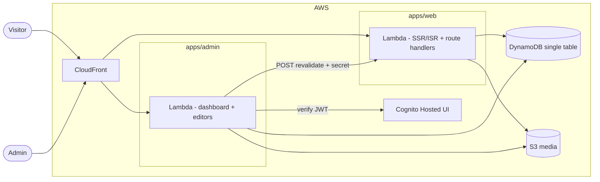

# Portfolio — khubaibqaiser.com

Source for **[Khubaib Qaiser](https://khubaibqaiser.com)**'s portfolio: a **Turborepo** monorepo with a public Next.js site (`apps/web`), a content-editing admin (`apps/admin`), and shared packages — running **serverless on AWS**, defined end-to-end as **infrastructure-as-code with AWS CDK**.

The apps are deployed with **[OpenNext](https://opennext.js.org/)** on **AWS Lambda + CloudFront**, content lives in a single **DynamoDB** table, admin auth is **Amazon Cognito**, media is on **S3**, and the whole platform (DNS, certs, alarms, budgets, CI deploy role) is provisioned by CDK.

---

## Overview

| Area                                          | Notes                                                                      |
| --------------------------------------------- | -------------------------------------------------------------------------- |
| **Monorepo** — Turborepo + pnpm               | One repo, shared packages, cached builds                                   |
| **Next.js 16 (App Router, RSC)**              | Server data, streaming, ISR; small client bundles                          |
| **Hosting** — OpenNext on Lambda + CloudFront | SSR/ISR, image optimization, streaming; no Vercel                          |
| **Data** — DynamoDB single table (ElectroDB)  | Content + resume history + rate-limit/cost counters                        |
| **Auth** — Amazon Cognito (Hosted UI + PKCE)  | Admin sign-in; email allowlist; `aws-jwt-verify`                           |
| **IaC** — AWS CDK (TypeScript)                | Every resource in `packages/infra`; `cdk deploy`                           |
| **CI/CD** — GitHub Actions + OIDC             | Lint/typecheck/build on PRs; deploy on push to `main` (no static AWS keys) |
| **Observability** — CloudWatch + PostHog      | Alarms/dashboard/budget + product analytics & error tracking               |

**Links:** [khubaibqaiser.com](https://khubaibqaiser.com) · admin and Storybook are deployed privately.

---

## Architecture

### Why these pieces

- **OpenNext + Lambda + CloudFront:** full Next.js 16 feature support (SSR, ISR, RSC streaming, image optimization) on serverless AWS, behind a global CDN — no always-on servers, scale-to-zero, pay-per-request.
- **DynamoDB (single table):** content, resume-generation history, and rate-limit/cost counters in one table with GSIs for the access patterns; on-demand billing, point-in-time recovery, and TTL for ephemeral counters.
- **Cognito:** managed admin auth via Hosted UI (OAuth authorization code + PKCE). Tokens are verified server-side with `aws-jwt-verify`; access is gated by an email allowlist.
- **S3 + CloudFront:** media uploads from admin (presigned), served from a public CDN URL rather than stored in the database.
- **Ports & adapters:** the apps depend on interfaces (`ContentRepository`, `MediaStore`, `RateLimiter`, `CostCap`, `AuthProvider`), not on AWS SDKs directly — so the same code runs locally against fixtures / DynamoDB Local and in production against AWS.
- **Groq + Anthropic via the Vercel AI SDK:** chat and the resume builder; the system prompt is built from DynamoDB-backed content so answers stay on topic.

### Request flow


```mermaid
flowchart LR
  user([Visitor])
  admin_user([Admin])

  subgraph aws [AWS]
    cf[CloudFront]
    subgraph web [apps/web]
      webfn[Lambda - SSR/ISR + route handlers]
    end
    subgraph adm [apps/admin]
      admfn[Lambda - dashboard + editors]
    end
    ddb[(DynamoDB single table)]
    s3[(S3 media)]
    cognito[Cognito Hosted UI]
  end

  user --> cf --> webfn --> ddb
  webfn --> s3
  admin_user --> cf --> admfn
  admfn -->|verify JWT| cognito
  admfn --> ddb
  admfn --> s3
  admfn -->|POST revalidate + secret| webfn
```

After a save in admin, it calls the public site's `POST /api/revalidate` with a shared secret so tagged caches refresh without a redeploy.

### AWS infrastructure (CDK stacks)

Defined in [`packages/infra`](packages/infra); see [`bin/portfolio.ts`](packages/infra/bin/portfolio.ts).

| Stack              | Region      | Contents                                                                                 |
| ------------------ | ----------- | ---------------------------------------------------------------------------------------- |
| `Portfolio-Data`   | `eu-west-1` | DynamoDB single table (GSIs, TTL, PITR) + S3 media bucket                                |
| `Portfolio-Web`    | `eu-west-1` | OpenNext web app: Lambda(s) + CloudFront + asset/cache buckets                           |
| `Portfolio-Auth`   | `eu-west-1` | Cognito user pool, app client (PKCE), Hosted UI, pre-token Lambda                        |
| `Portfolio-Admin`  | `eu-west-1` | OpenNext admin app: Lambda(s) + CloudFront (wired to Auth + Data)                        |
| `Portfolio-Shared` | `eu-west-1` | EventBridge bus, SNS alerts, SES identity, CloudWatch alarms + dashboard, AWS Budget     |
| `Portfolio-Oidc`   | `eu-west-1` | GitHub Actions OIDC provider + least-privilege deploy role (opt-in via `-c githubRepo=`) |
| `Portfolio-Dns`    | `us-east-1` | Route 53 public hosted zone for the apex domain                                          |
| `Portfolio-Cert`   | `us-east-1` | ACM certificate for CloudFront (opt-in via `-c domainEnabled=true`)                      |

The custom domain is **deferred**: until the registrar nameservers are delegated to Route 53 (`-c domainEnabled=true`), both apps run on their default `*.cloudfront.net` URLs.

---

## Repository structure

```
portfolio-v2/
├── apps/
│   ├── web/                 # Public site — Next.js, route handlers, chat, resume PDF
│   └── admin/               # CMS — Cognito auth, editors, media uploads, revalidation
├── packages/
│   ├── shared/              # Types, Zod schemas, ports (interfaces), constants
│   ├── data/                # DynamoDB single-table adapters (ElectroDB) + fixtures + seed
│   ├── ai/                  # Model factory, prompts, Zod schemas, guardrails, telemetry
│   ├── ui/                  # Design system + Storybook
│   ├── infra/               # AWS CDK app — all stacks and constructs (OpenNext site)
│   └── eslint-config/       # Shared ESLint
├── .github/workflows/       # CI (lint/typecheck/build, Lighthouse) + Deploy (OIDC → cdk)
├── docker-compose.dev.yml   # DynamoDB Local for offline `dynamo` backend
├── turbo.json
└── pnpm-workspace.yaml
```

| Package                  | NPM name                   | Role                                          |
| ------------------------ | -------------------------- | --------------------------------------------- |
| `apps/web`               | `@portfolio/web`           | Public site (port **3000**)                   |
| `apps/admin`             | `@portfolio/admin`         | Admin (port **3001**)                         |
| `packages/shared`        | `@portfolio/shared`        | Types, Zod, **ports**, constants              |
| `packages/data`          | `@portfolio/data`          | DynamoDB adapters, fixtures, seed script      |
| `packages/ai`            | `@portfolio/ai`            | Model factory, prompts, guardrails, telemetry |
| `packages/ui`            | `@portfolio/ui`            | UI kit, Storybook (**6006**)                  |
| `packages/infra`         | `@portfolio/infra`         | CDK app (stacks + constructs)                 |
| `packages/eslint-config` | `@portfolio/eslint-config` | Shared ESLint                                 |

---

## Technology stack

### Core

| Layer     | Choice                                     |
| --------- | ------------------------------------------ |
| Framework | **Next.js 16** (App Router, RSC, ISR)      |
| UI        | **React 19**, **Tailwind CSS v4**          |
| Language  | **TypeScript** (strict)                    |
| Monorepo  | **Turborepo** + **pnpm**                   |
| Hosting   | **OpenNext** → **AWS Lambda + CloudFront** |
| IaC       | **AWS CDK** (TypeScript)                   |

### Public site (`apps/web`)

| Concern            | Implementation                                                    |
| ------------------ | ----------------------------------------------------------------- |
| Motion             | Framer Motion                                                     |
| Theme              | `next-themes`                                                     |
| Command palette    | `cmdk`                                                            |
| Chat               | **Vercel AI SDK** + **Groq** (prompt built from DynamoDB content) |
| Resume PDF         | `@react-pdf/renderer` (route handler)                             |
| Content            | DynamoDB (server) + Next cache tags + on-demand revalidate        |
| Analytics / errors | **PostHog** (events, `$exception`, alerts)                        |

### Admin (`apps/admin`)

| Concern   | Implementation                                                                                                                                           |
| --------- | -------------------------------------------------------------------------------------------------------------------------------------------------------- |
| Forms     | **React Hook Form** + **Zod**                                                                                                                            |
| Auth      | **Amazon Cognito** Hosted UI (OAuth code + PKCE), httpOnly cookies, `aws-jwt-verify`, email allowlist                                                    |
| Media     | **AWS SDK** → **S3** (presigned), served via CloudFront                                                                                                  |
| Resume AI | **Vercel AI SDK** + **Anthropic** (Claude Sonnet 4.5, primary) + **Groq** (draft + silent fallback + ATS); structured Zod output, `streamObject` preview |

### Data layer (`packages/data`)

A **single DynamoDB table** modelled with **ElectroDB**. The apps talk to **ports** (interfaces in `@portfolio/shared/ports`); adapters implement them:

- `ContentRepository` — hero, about, experience, projects, skills, resume, testimonials, site config, resume-generation history.
- `MediaStore` — presigned S3 uploads + public URL resolution.
- `RateLimiter` / `CostCap` — DynamoDB-backed sliding-window limits and a daily USD cap (TTL-expired counters).
- `AuthProvider` — the admin identity contract (Cognito in prod).

Backend is selected by `DATA_BACKEND`:

- `fixture` (default) — static fixtures, no AWS, instant local UI work.
- `dynamo` — real DynamoDB; point `DYNAMODB_LOCAL_ENDPOINT` at DynamoDB Local for offline, or leave unset in Lambda (uses the function's IAM role).

Seed the table from fixtures (idempotent):

```bash
pnpm --filter @portfolio/data seed
```

---

## Observability, cost & security

- **CloudWatch** (in `Portfolio-Shared`): DynamoDB throttle/system-error alarms (scoped to the operations actually used), a dashboard, and an **AWS Budget** — all wired to an **SNS** topic that emails `alertEmail`.
- **PostHog**: product events (`portfolio_*`), `$pageview`, and `$exception` capture with source-map upload on production builds. Custom event names live in [`apps/web/src/lib/analytics/events.ts`](apps/web/src/lib/analytics/events.ts).
- **Error policy:** no silent swallowing — build-time errors throw; runtime errors surface to PostHog / CloudWatch alarms rather than being treated as success.
- **Auth:** Cognito tokens verified server-side with `aws-jwt-verify`; `requireAdmin()` re-checks the allowlist at **every mutation boundary** (the middleware route guard is for UX, not the sole gate).
- **Admin IAM:** the admin Lambda is granted only read/write to the content table and media bucket.
- **Headers:** default security headers on the public app ([`apps/web/next.config.ts`](apps/web/next.config.ts)).
- **Resume AI:** prompt-injection stripping, Zod-validated structured output, fabrication checks, AI-tone retry, per-user rate limit, and a daily USD cost cap (`RESUME_GEN_DAILY_USD_CAP`); PDF uploads size-capped + magic-byte checked.

---

## Local development

### Prerequisites

- **Node.js** ≥ 20 (CI uses 22)
- **pnpm** 10.x — `corepack enable` (see [`package.json`](package.json) `packageManager`)
- **Docker** (only for the `dynamo` backend via DynamoDB Local)

### Install

```bash
git clone https://github.com/khubaibqaiser/portfolio-v2.git
cd portfolio-v2
pnpm install
cp apps/web/.env.example apps/web/.env.local
cp apps/admin/.env.example apps/admin/.env.local
```

With `DATA_BACKEND=fixture` (the default) you can run the UI immediately — no AWS, no Docker.

### Working against DynamoDB locally (optional)

```bash
pnpm ddb:up                              # DynamoDB Local on :8000
# set in .env.local: DATA_BACKEND=dynamo  DYNAMODB_LOCAL_ENDPOINT=http://localhost:8000
pnpm --filter @portfolio/data seed       # load fixtures into the local table
pnpm ddb:down                            # stop it
```

### Commands

| Command                               | Description                            |
| ------------------------------------- | -------------------------------------- |
| `pnpm dev`                            | All apps (Turborepo)                   |
| `pnpm dev:web`                        | Web only — http://localhost:3000       |
| `pnpm dev:admin`                      | Admin only — http://localhost:3001     |
| `pnpm storybook`                      | Storybook — http://localhost:6006      |
| `pnpm build`                          | Production build                       |
| `pnpm lint` / `pnpm typecheck`        | ESLint / `tsc --noEmit`                |
| `pnpm test` / `pnpm test:integration` | Vitest (unit / against DynamoDB Local) |
| `pnpm format` / `pnpm format:check`   | Prettier                               |
| `pnpm ddb:up` / `pnpm ddb:down`       | DynamoDB Local via Docker Compose      |

---

## Deploying to AWS (getting started)

Everything is CDK. You need an AWS account and the AWS CLI configured (e.g. an IAM user named `portfolio-deployer` with admin or scoped deploy rights). Region is **`eu-west-1`** by default.

### 1. One-time bootstrap

CDK needs a bootstrap stack per account/region it deploys into (here `eu-west-1`, plus `us-east-1` only when you enable the custom domain):

```bash
cd packages/infra
pnpm exec cdk bootstrap aws://<ACCOUNT_ID>/eu-west-1
```

### 2. Deploy the platform

From `packages/infra` (run with your real values). The first deploy creates DynamoDB, the Cognito pool, both OpenNext apps, and shared services:

```bash
# Build the OpenNext bundles the app stacks reference:
pnpm --filter @portfolio/web exec open-next build
pnpm --filter @portfolio/admin exec open-next build

# Deploy (adminUrls = the admin's CloudFront URL, needed for Cognito callback URLs):
pnpm exec cdk deploy \
  Portfolio-Data Portfolio-Auth Portfolio-Web Portfolio-Admin Portfolio-Shared \
  --require-approval never \
  -c adminUrls=https://<admin-distribution>.cloudfront.net \
  -c alertEmail=you@example.com \
  -c contactEmail=you@example.com
```

> Chicken-and-egg note: the admin CloudFront URL isn't known until the distribution exists. On the very first deploy, deploy `Portfolio-Admin` once to mint the URL, then re-run with `-c adminUrls=<that URL>` so Cognito's callback/logout URLs and the app's `APP_ORIGIN` match.

### 3. Create an admin user

Self-signup is disabled. Create the allow-listed admin in the pool (they set a permanent password at first Hosted UI login):

```bash
aws cognito-idp admin-create-user \
  --user-pool-id <USER_POOL_ID> \
  --username you@example.com \
  --user-attributes Name=email,Value=you@example.com Name=email_verified,Value=true \
  --message-action SUPPRESS \
  --temporary-password '<TempPass#12+chars>'
```

Add allowed emails in [`packages/shared/src/constants.ts`](packages/shared/src/constants.ts) (`ADMIN_ALLOWED_EMAILS`).

### 4. Seed content

```bash
DATA_BACKEND=dynamo DYNAMO_TABLE_NAME=portfolio AWS_REGION=eu-west-1 \
  pnpm --filter @portfolio/data seed
```

### 5. (Later) Custom domain

Delegate the registrar's nameservers to Route 53, then redeploy with the domain enabled:

```bash
pnpm exec cdk deploy Portfolio-Dns          # prints the 4 Route 53 nameservers
# paste those into your registrar, then:
pnpm exec cdk deploy --all -c domainEnabled=true
```

### Optional services to enable

- **Google sign-in:** put the Google OAuth client id/secret in SSM and deploy Auth with `-c googleAuthEnabled=true`.
- **CI deploy role:** deploy `Portfolio-Oidc` with `-c githubRepo=owner/name` (see CI/CD below).

---

## CI/CD (GitHub Actions + OIDC)

Two workflows in [`.github/workflows`](.github/workflows):

**`ci.yml`** — on every PR and push to `main`: lint → typecheck → build. PRs also run **Lighthouse CI** on the web app. No AWS credentials needed.

**`deploy.yml`** — on push to `main`: builds both OpenNext bundles and runs `cdk deploy` for the six regional stacks. Authentication uses **GitHub OIDC** — GitHub mints a short-lived token and assumes the `Portfolio-gha-deploy` role; **there are no long-lived AWS keys in GitHub**. The role's trust policy is pinned to this repo's `main` branch / `production` environment, and it can only assume the CDK bootstrap roles (CloudFormation does the actual work).

It runs under the `production` GitHub Environment, so you can optionally add **required reviewers** for a manual approval gate; without reviewers it deploys automatically on every merge to `main`.

### One-time GitHub setup

1. Deploy the OIDC stack: `cdk deploy Portfolio-Oidc -c githubRepo=owner/name` and copy the `DeployRoleArn` output.
2. In **Settings → Environments**, create an environment named **`production`** (add required reviewers here if you want a gate).
3. In **Settings → Secrets and variables → Actions → Variables**, add repository **Variables**:

   | Variable               | Example                                            |
   | ---------------------- | -------------------------------------------------- |
   | `AWS_REGION`           | `eu-west-1`                                        |
   | `AWS_DEPLOY_ROLE_ARN`  | `arn:aws:iam::<account>:role/Portfolio-gha-deploy` |
   | `ADMIN_URLS`           | `https://<admin-distribution>.cloudfront.net`      |
   | `ALERT_EMAIL`          | `you@example.com`                                  |
   | `CONTACT_EMAIL`        | `you@example.com`                                  |
   | `NEXT_PUBLIC_SITE_URL` | `https://khubaibqaiser.com`                        |

After that, every push to `main` builds and deploys.

---

## Environment setup

Copy **`apps/web/.env.example`** and **`apps/admin/.env.example`** to **`.env.local`** in each app (Next loads `.env.local` in dev). All vars are optional at build time; the relevant ones are required at runtime.

### Web — `apps/web`

| Variable                                                      | Purpose                                                  |
| ------------------------------------------------------------- | -------------------------------------------------------- |
| `NEXT_PUBLIC_SITE_URL`                                        | Canonical URL (metadata, sitemap, robots)                |
| `REVALIDATE_SECRET`                                           | Header secret for `POST /api/revalidate` — same as admin |
| `GROQ_API_KEY`                                                | Groq — chat returns 503 if missing                       |
| `GITHUB_TOKEN`                                                | Optional — higher GitHub API limits for `/api/github`    |
| `NEXT_PUBLIC_POSTHOG_PROJECT_TOKEN`                           | PostHog project API key                                  |
| `NEXT_PUBLIC_POSTHOG_HOST`                                    | Ingestion host (US/EU)                                   |
| `NEXT_PUBLIC_POSTHOG_UI_HOST`                                 | PostHog app URL for toolbar links                        |
| `NEXT_PUBLIC_POSTHOG_ENVIRONMENT` / `POSTHOG_ENVIRONMENT`     | Optional environment tag                                 |
| `POSTHOG_API_KEY` / `POSTHOG_PROJECT_ID` / `POSTHOG_APP_HOST` | Source-map upload on production builds                   |
| `CHAT_RATE_LIMIT_MAX` / `CHAT_RATE_LIMIT_WINDOW_SEC`          | Chat rate limit (per IP, via the RateLimiter port)       |
| `DATA_BACKEND`                                                | `fixture` (default) or `dynamo`                          |
| `DYNAMO_TABLE_NAME`                                           | Single-table name (default `portfolio`)                  |
| `DYNAMODB_LOCAL_ENDPOINT`                                     | DynamoDB Local endpoint (local only)                     |
| `AWS_REGION`                                                  | Primary region (default `eu-west-1`)                     |
| `MEDIA_PUBLIC_BASE_URL`                                       | Public base URL media is served from (S3/CloudFront)     |
| `S3_MEDIA_BUCKET` / `S3_ENDPOINT`                             | Media bucket; optional local S3 endpoint                 |

### Admin — `apps/admin`

| Variable                                                         | Purpose                                                                      |
| ---------------------------------------------------------------- | ---------------------------------------------------------------------------- |
| `COGNITO_REGION`                                                 | Cognito region (default `eu-west-1`)                                         |
| `COGNITO_USER_POOL_ID`                                           | Cognito user pool id                                                         |
| `COGNITO_CLIENT_ID`                                              | App client id (public, PKCE)                                                 |
| `COGNITO_DOMAIN`                                                 | Hosted UI base URL                                                           |
| `APP_ORIGIN`                                                     | Public app origin for OAuth redirect/logout (unset locally → request origin) |
| `NEXT_PUBLIC_WEB_URL`                                            | Public site base URL (for revalidate calls)                                  |
| `REVALIDATE_SECRET`                                              | Same as web                                                                  |
| `S3_MEDIA_BUCKET` / `MEDIA_PUBLIC_BASE_URL` / `S3_ENDPOINT`      | Media uploads + public URL                                                   |
| `AWS_REGION`                                                     | Primary region                                                               |
| `ANTHROPIC_API_KEY`                                              | Resume AI — Claude Sonnet 4.5 (primary)                                      |
| `GROQ_API_KEY`                                                   | Resume AI — Groq (draft, fallback, ATS)                                      |
| `RESUME_GEN_DAILY_USD_CAP`                                       | Daily spend cap per admin (default `5`)                                      |
| `DATA_BACKEND` / `DYNAMO_TABLE_NAME` / `DYNAMODB_LOCAL_ENDPOINT` | Data layer (as web)                                                          |

In production these are injected by CDK (`Portfolio-Admin` sets the `COGNITO_*`, `APP_ORIGIN`, and data-layer vars on the Lambda; the IAM role supplies AWS credentials). Set them in `.env.local` only to exercise the real backends locally.

---

## Roadmap

- **Contact form:** wire to SES (identity already provisioned in `Portfolio-Shared`).
- **EventBridge-driven revalidation:** emit content-change events to refresh ISR instead of the direct revalidate call.
- **Custom domain:** delegate nameservers → Route 53, deploy `Dns`+`Cert` with `-c domainEnabled=true`.
- **CI tests job:** run Vitest (and the DynamoDB-Local integration suite) in CI.
- **Analytics:** PostHog funnels / dashboards from the `portfolio_*` events.

---

## Author

**Khubaib Qaiser** — Senior Software Engineer

- [khubaibqaiser.com](https://khubaibqaiser.com)
- [github.com/khubaibqaiser](https://github.com/khubaibqaiser)
- [linkedin.com/in/khubaib-qaiser](https://linkedin.com/in/khubaib-qaiser)

---

## License

Proprietary. All rights reserved. See [LICENSE](./LICENSE).
