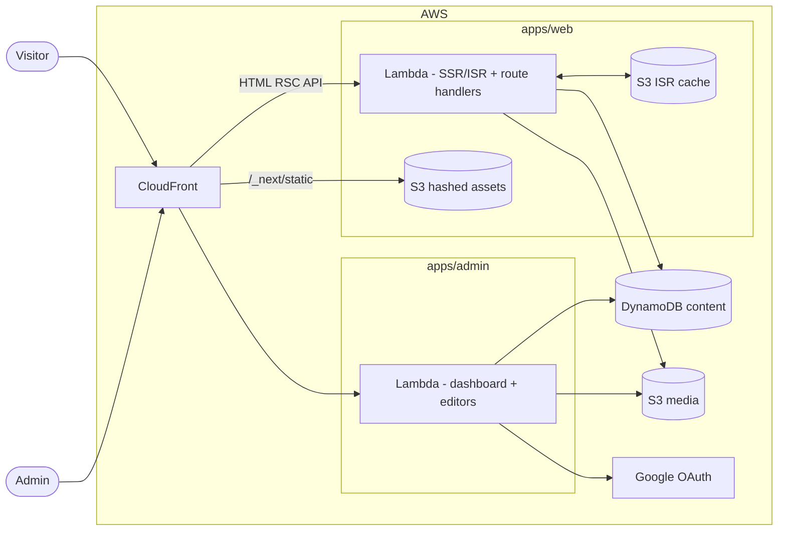

# Portfolio — khubaibqaiser.com

Source for **[Khubaib Qaiser](https://khubaibqaiser.com)**'s portfolio: a **Turborepo** monorepo with a public Next.js site (`apps/web`), a content-editing admin (`apps/admin`), an OAuth-authenticated MCP server for external automation (`apps/candidate-mcp`), and shared packages — running **serverless on AWS**, defined end-to-end as **infrastructure-as-code with AWS CDK**.

The apps are deployed with **[OpenNext](https://opennext.js.org/)** on **AWS Lambda + CloudFront**, content lives in **DynamoDB** (one table per aggregate), admin auth is **[Better Auth](https://www.better-auth.com/)** (Google sign-in, stateless sessions), media is on **S3**, and the whole platform (DNS, certs, alarms, budgets, CI deploy role) is provisioned by CDK.

---

## Overview

| Area                                          | Notes                                                                  |
| --------------------------------------------- | ---------------------------------------------------------------------- |
| **Monorepo** — Turborepo + pnpm               | One repo, shared packages, cached builds                               |
| **Next.js 16 (App Router, RSC)**              | Server data, streaming, time-based ISR                                 |
| **Hosting** — OpenNext on Lambda + CloudFront | SSR/ISR, image optimization, streaming                                 |
| **Data** — DynamoDB, one table per entity     | Clean key schemas; content + resume history + rate-limit/cost counters |
| **Auth** — Better Auth + Google (stateless)   | Admin sign-in; email allowlist; encrypted session cookies              |
| **IaC** — AWS CDK (TypeScript)                | Every resource in `packages/infra`; `cdk deploy`                       |
| **CI/CD** — GitHub Actions + OIDC             | Lint/typecheck/build on PRs; deploy on push to `main`                  |
| **Observability** — CloudWatch + PostHog      | Alarms/dashboard/budget + product analytics & error tracking           |

**Links:** [khubaibqaiser.com](https://khubaibqaiser.com) · admin and Storybook are deployed privately.

---

## Architecture

### Why these pieces

- **OpenNext + Lambda + CloudFront:** full Next.js 16 feature support (SSR, ISR, RSC streaming, image optimization) on serverless AWS, behind a global CDN — no always-on servers, scale-to-zero, pay-per-request.
- **Time-based ISR (10 seconds):** the public site revalidates cached content pages every 10 seconds. Admin saves go straight to DynamoDB; visitors see updates within the revalidation window. No on-demand invalidation, tag cache, SQS, or revalidation Lambda.
- **DynamoDB (table-per-entity):** each aggregate gets its own table with a clean, readable key schema. On-demand billing, point-in-time recovery on durable tables, and TTL on the ephemeral rate-limit table.
- **Better Auth (stateless):** Google OAuth for admin sign-in with encrypted cookie sessions — no auth database. Access is gated by an email allowlist at sign-in and on every mutation.
- **S3 + CloudFront:** media uploads from admin (presigned), served from a public CDN URL.
- **Ports & adapters:** the apps depend on interfaces (`ContentRepository`, `MediaStore`, `RateLimiter`, `CostCap`, `AuthProvider`), not on AWS SDKs directly — so the same code runs locally against fixtures / DynamoDB Local and in production against AWS.
- **Groq + Anthropic via the Vercel AI SDK:** chat and the resume builder; the system prompt is built from DynamoDB-backed content.

### Request flow


```mermaid
flowchart LR
  user([Visitor])
  admin_user([Admin])

  subgraph aws [AWS]
    cf[CloudFront]
    subgraph web [apps/web]
      webfn[Lambda - SSR/ISR + route handlers]
      s3assets[(S3 hashed assets)]
      s3cache[(S3 ISR cache)]
    end
    subgraph adm [apps/admin]
      admfn[Lambda - dashboard + editors]
    end
    ddb[(DynamoDB content)]
    s3media[(S3 media)]
    google[Google OAuth]
  end

  user --> cf
  cf -->|"HTML RSC API"| webfn
  cf -->|"/_next/static"| s3assets
  webfn <--> s3cache
  webfn --> ddb
  webfn --> s3media
  admin_user --> cf --> admfn
  admfn --> google
  admfn --> ddb
  admfn --> s3media
```

Deeper routing, cache headers, and deploy ordering:
[docs/architecture.md](docs/architecture.md).

### OpenNext caching

Each site (`web` and `admin`) uses OpenNext with:

- **Hashed static assets** (`_assets/_next/**`) — `immutable`, never pruned on
  deploy; unused hashes expire after 30 days so stale HTML can still load CSS/JS.
- **Unhashed public files** — short browser cache; CloudFront invalidated on deploy.
- **S3 incremental cache** — ISR/SSG seed under `_cache` (replaced each deploy).
- **`queue: "direct"`** — when a page is stale, the server Lambda regenerates via
  a self HEAD request (no SQS or separate revalidation Lambda).
- **`disableTagCache: true`** — no DynamoDB tag cache; content pages use
  `export const revalidate = 10` and data loaders use React `cache()` for
  per-request dedup.
- **Web `expireTime: 60`** — caps document `stale-while-revalidate` so browsers
  do not keep ISR HTML for ~1 year across releases.

The admin app is `force-dynamic` — it always reads fresh content from DynamoDB.

### AWS infrastructure (CDK stacks)

Defined in [`packages/infra`](packages/infra); see [`bin/portfolio.ts`](packages/infra/bin/portfolio.ts).

| Stack                    | Region      | Contents                                                                                                                                                                                                   |
| ------------------------ | ----------- | ---------------------------------------------------------------------------------------------------------------------------------------------------------------------------------------------------------- |
| `Portfolio-Data`         | `eu-west-1` | DynamoDB tables + S3 media bucket + AI key secrets                                                                                                                                                         |
| `Portfolio-Web`          | `eu-west-1` | OpenNext web app: server + image Lambdas, CloudFront, S3 assets/cache                                                                                                                                      |
| `Portfolio-Auth`         | `eu-west-1` | Better Auth secrets (Google OAuth JSON + signing key)                                                                                                                                                      |
| `Portfolio-Admin`        | `eu-west-1` | OpenNext admin app: server + image Lambdas, CloudFront                                                                                                                                                     |
| `Portfolio-Shared`       | `eu-west-1` | EventBridge, SNS alerts, SES identity, CloudWatch alarm + dashboard, AWS Budget                                                                                                                            |
| `Portfolio-Storybook`    | `eu-west-1` | Static Storybook: private S3 + CloudFront                                                                                                                                                                  |
| `Portfolio-Oidc`         | `eu-west-1` | GitHub Actions OIDC deploy role (opt-in via `-c githubRepo=`)                                                                                                                                              |
| `Portfolio-Dns`          | `us-east-1` | Route 53 hosted zone                                                                                                                                                                                       |
| `Portfolio-Cert`         | `us-east-1` | ACM certificate for CloudFront (opt-in via `-c domainEnabled=true`)                                                                                                                                        |
| `Portfolio-CandidateMcp` | `eu-west-1` | Candidate profile MCP server: API-key auth, Lambda, CloudFront (requires `domainEnabled=true`; see [ADR 0003](docs/adr/0003-candidate-mcp-server.md), [ADR 0005](docs/adr/0005-candidate-mcp-api-keys.md)) |

The custom domain is **deferred by default** (`domainEnabled=false`): both apps run on their default `*.cloudfront.net` URLs until you delegate nameservers and redeploy with `-c domainEnabled=true`.

---

## Repository structure

```
portfolio-v2/
├── apps/
│   ├── web/                 # Public site — Next.js, route handlers, chat, resume PDF
│   ├── admin/               # CMS — Better Auth, editors, media uploads
│   └── candidate-mcp/       # Candidate profile MCP server (API-key auth, network-facing)
├── packages/
│   ├── shared/              # Types, Zod schemas, ports, constants
│   ├── data/                # DynamoDB adapter + fixtures + seed
│   ├── ai/                  # Model factory, prompts, guardrails, telemetry, evals
│   ├── ui/                  # Design system + Storybook
│   ├── infra/               # AWS CDK app — all stacks and constructs
│   ├── agent-mcp/           # Read-only MCP server (ADRs + AI contracts)
│   └── eslint-config/       # Shared ESLint
├── specs/                   # Acceptance specs (Resume AI contract)
├── .cursor/rules/           # Scoped agent rules
├── AGENTS.md                # Agent operating manual
├── .github/workflows/       # CI: lint, tests, evals, e2e, Lighthouse, deploy
├── docker-compose.dev.yml   # DynamoDB Local
├── turbo.json
└── pnpm-workspace.yaml
```

---

## Technology stack

### Public site (`apps/web`)

| Concern            | Implementation                                                        |
| ------------------ | --------------------------------------------------------------------- |
| Content            | DynamoDB via `ContentRepository`; content pages use `revalidate = 10` |
| Chat               | Vercel AI SDK + Groq (prompt from DynamoDB content)                   |
| Resume PDF         | `@react-pdf/renderer` (dynamic route handler)                         |
| Analytics / errors | PostHog (events, `$exception`, source maps)                           |

### Admin (`apps/admin`)

| Concern   | Implementation                                                           |
| --------- | ------------------------------------------------------------------------ |
| Auth      | Better Auth + Google OAuth, stateless encrypted cookies, email allowlist |
| Forms     | React Hook Form + Zod                                                    |
| Media     | S3 presigned uploads                                                     |
| Resume AI | Vercel AI SDK + Anthropic + Groq; structured Zod output                  |

### Data layer (`packages/data`)

**DynamoDB with one table per aggregate.** Singletons (`hero`, `about`, `site-config`, `resume`) live in the `content` table keyed by `section`; collections get their own table keyed by `id`.

Backend is selected by `DATA_BACKEND`:

- `fixture` (default) — static fixtures, no AWS.
- `dynamo` — real DynamoDB; point `DYNAMODB_LOCAL_ENDPOINT` at DynamoDB Local for offline.

Seed the tables from fixtures (idempotent):

```bash
pnpm --filter @portfolio/data seed
```

---

## Local development

### Prerequisites

- **Node.js** ≥ 20 (CI uses 22)
- **pnpm** 10.x — `corepack enable`
- **Docker** (only for the `dynamo` backend)

### Install

```bash
git clone https://github.com/khubaibqaiser/portfolio-v2.git
cd portfolio-v2
pnpm install
cp apps/web/.env.example apps/web/.env.local
cp apps/admin/.env.example apps/admin/.env.local
```

With `DATA_BACKEND=fixture` (the default) you can run the UI immediately.

### Commands

| Command                         | Description                                   |
| ------------------------------- | --------------------------------------------- |
| `pnpm dev`                      | All apps                                      |
| `pnpm dev:web`                  | Web — http://localhost:3000                   |
| `pnpm dev:admin`                | Admin — http://localhost:3001                 |
| `pnpm build`                    | Production build                              |
| `pnpm lint` / `pnpm typecheck`  | ESLint / `tsc --noEmit`                       |
| `pnpm test`                     | Vitest unit tests                             |
| `pnpm eval:resume`              | Offline Resume AI eval fixtures (no API keys) |
| `pnpm test:e2e`                 | Playwright (public site, fixture mode)        |
| `pnpm ddb:up` / `pnpm ddb:down` | DynamoDB Local                                |

---

## Deploying to AWS

Everything is CDK. Region defaults to **`eu-west-1`**.

### Bootstrap

```bash
cd packages/infra
pnpm exec cdk bootstrap aws://<ACCOUNT_ID>/eu-west-1
```

### Deploy

Requires AWS credentials and an existing **Portfolio-Data** stack (SSM must publish
`/portfolio/data/media-public-base-url` before OpenNext builds).

```bash
# Resolves MEDIA_PUBLIC_BASE_URL from SSM, builds OpenNext bundles + Storybook,
# and verifies the image optimizer allowlist is baked into the artifacts.
pnpm build:open-next

cd packages/infra
pnpm exec cdk deploy \
  Portfolio-Data Portfolio-Auth Portfolio-Web Portfolio-Admin Portfolio-Shared Portfolio-Storybook \
  --require-approval never \
  -c adminUrls=https://<admin-distribution>.cloudfront.net \
  -c alertEmail=you@example.com \
  -c contactEmail=you@example.com

# Optional: verify /_next/image serves a real media object after deploy
pnpm smoke-test:images
```

On first deploy, run `Portfolio-Admin` once to get the CloudFront URL, then re-run with `-c adminUrls=<that URL>` so `APP_ORIGIN` and Google OAuth redirect URIs match.

### Google sign-in (admin)

1. Deploy `Portfolio-Auth` (creates empty Google OAuth secret + auto-generated Better Auth signing secret).
2. Inject Google OAuth credentials (JSON):
   ```bash
   aws secretsmanager put-secret-value \
     --region eu-west-1 \
     --secret-id /portfolio/google-oauth \
     --secret-string '{"clientId":"YOUR_GOOGLE_CLIENT_ID","clientSecret":"YOUR_GOOGLE_CLIENT_SECRET"}'
   ```
3. In [Google Cloud Console](https://console.cloud.google.com/), configure the OAuth client:
   - **Authorized redirect URI:** `https://<admin-origin>/api/auth/callback/google` (and `http://localhost:3001/api/auth/callback/google` for local dev)
   - **Authorized JavaScript origin:** the admin origin (CloudFront URL or custom domain)

| Secret name                     | SSM ARN param                            | Lambda env                | Used by                                        |
| ------------------------------- | ---------------------------------------- | ------------------------- | ---------------------------------------------- |
| `/portfolio/google-oauth`       | `/portfolio/auth/google-oauth-arn`       | `GOOGLE_OAUTH_SECRET_ARN` | Admin (Better Auth Google provider)            |
| `/portfolio/better-auth-secret` | `/portfolio/auth/better-auth-secret-arn` | `BETTER_AUTH_SECRET_ARN`  | Admin (session signing; auto-generated by CDK) |

**Note:** Resume history and usage counters are keyed by the Google account id (`profile.sub`).

### AI API keys

CDK creates the secret resources in `Portfolio-Data` and publishes complete ARNs to SSM. Inject values out-of-band:

```bash
aws secretsmanager put-secret-value \
  --region eu-west-1 \
  --secret-id /portfolio/groq-api-key \
  --secret-string "YOUR_GROQ_KEY"

aws secretsmanager put-secret-value \
  --region eu-west-1 \
  --secret-id /portfolio/anthropic-api-key \
  --secret-string "YOUR_ANTHROPIC_KEY"
```

| Secret name                    | SSM ARN param                         | Lambda env                     | Used by     |
| ------------------------------ | ------------------------------------- | ------------------------------ | ----------- |
| `/portfolio/groq-api-key`      | `/portfolio/ai/groq-api-key-arn`      | `GROQ_API_KEY_SECRET_ARN`      | Web + Admin |
| `/portfolio/anthropic-api-key` | `/portfolio/ai/anthropic-api-key-arn` | `ANTHROPIC_API_KEY_SECRET_ARN` | Admin       |

### Contact form (Resend + Turnstile)

1. **Resend:** verify a sending domain at [resend.com/domains](https://resend.com/domains), then create an API key (Sending access).
2. **Turnstile:** Cloudflare dashboard → Turnstile → add site with widget type **Invisible**; hostnames include prod + `localhost`.
3. Deploy `Portfolio-Data` (creates empty secret shells), then inject values:

```bash
aws secretsmanager put-secret-value \
  --region eu-west-1 \
  --secret-id /portfolio/resend-api-key \
  --secret-string "YOUR_RESEND_KEY"

aws secretsmanager put-secret-value \
  --region eu-west-1 \
  --secret-id /portfolio/turnstile-secret-key \
  --secret-string "YOUR_TURNSTILE_SECRET"
```

| Secret name                       | SSM ARN param                              | Lambda env                        | Used by |
| --------------------------------- | ------------------------------------------ | --------------------------------- | ------- |
| `/portfolio/resend-api-key`       | `/portfolio/email/resend-api-key-arn`      | `RESEND_API_KEY_SECRET_ARN`       | Web     |
| `/portfolio/turnstile-secret-key` | `/portfolio/auth/turnstile-secret-key-arn` | `TURNSTILE_SECRET_KEY_SECRET_ARN` | Web     |

GitHub variables for deploy: `CONTACT_EMAIL` (recipient), `CONTACT_FROM_EMAIL` (verified Resend from address), `NEXT_PUBLIC_TURNSTILE_SITE_KEY` (baked in at OpenNext build).

### Seed content

```bash
DATA_BACKEND=dynamo DYNAMO_TABLE_PREFIX=portfolio AWS_REGION=eu-west-1 \
  pnpm --filter @portfolio/data seed
```

After seeding, allow a short ISR window for the public site to reflect changes (or redeploy to pick up fresh build output).

### Custom domain

1. `cdk deploy Portfolio-Dns` — delegate nameservers at your registrar.
2. `cdk deploy Portfolio-Cert -c domainEnabled=true` — wait for ACM to issue.
3. `cdk deploy --all -c domainEnabled=true` — wire CloudFront aliases and admin `APP_ORIGIN`.

Google Search Console Domain verification is a Route 53 apex TXT record. Set GitHub variable `GOOGLE_DNS_SITE_VERIFICATION` to the full `google-site-verification=…` string; CI passes `-c googleDnsSiteVerification=` into CDK. Do not put that string in a page meta tag.

Cross-stack wiring uses the **SSM registry** — see [ADR 0001](docs/adr/0001-cross-stack-references.md).

---

## CI/CD

GitHub Actions ([`.github/workflows/ci.yml`](.github/workflows/ci.yml)) runs lint (including Prettier) → typecheck → unit tests → DynamoDB Local integration → **Gitleaks** → **offline Resume AI evals** → **Playwright e2e** → **candidate-mcp security tests** (`mcp-security` job: auth/sanitize/rate-limit unit tests plus `CandidateMcpStack`'s CDK synth assertions, all offline) in parallel, then build → Lighthouse (desktop + mobile) → deploy on push to `main`. Deploy uses **OIDC** (no long-lived AWS keys) and waits on Lighthouse, e2e, evals, the secret scan, and `mcp-security`; once deployed, it also runs a live smoke test against `apps/candidate-mcp` when `DOMAIN_ENABLED` is set.

Repository variables: `AWS_REGION`, `AWS_DEPLOY_ROLE_ARN`, `ALERT_EMAIL`, `CONTACT_EMAIL`, `CONTACT_FROM_EMAIL`, `NEXT_PUBLIC_TURNSTILE_SITE_KEY`, `NEXT_PUBLIC_SITE_URL`, `DOMAIN_ENABLED`, `ADMIN_URLS`, `APP_ORIGIN` (admin origin for Server Actions `allowedOrigins` at build time, e.g. `https://admin.khubaibqaiser.com`), `GOOGLE_DNS_SITE_VERIFICATION` (Search Console Domain TXT: `google-site-verification=…`), plus PostHog (below).

**PostHog (deploy):** bake client analytics and source maps into the OpenNext build; inject token/host on the web Lambda for server events. Set these GitHub **variables**: `NEXT_PUBLIC_POSTHOG_PROJECT_TOKEN`, `NEXT_PUBLIC_POSTHOG_HOST`, `NEXT_PUBLIC_POSTHOG_UI_HOST`, `NEXT_PUBLIC_POSTHOG_ENVIRONMENT`, `POSTHOG_PROJECT_ID`, `POSTHOG_APP_HOST`. Set GitHub **secret** `POSTHOG_API_KEY` (personal API key) for source-map upload at build time. CDK receives `-c posthogProjectToken` / `posthogHost` / `posthogEnvironment` for Lambda runtime.

---

## Candidate Profile MCP server

[`apps/candidate-mcp`](apps/candidate-mcp) is a second, deliberately separate
MCP server from `packages/agent-mcp` below: it is **network-reachable**, so
that external automation (an n8n workflow today, Apify actors in a later
phase) can pull the same candidate profile data already public on
`khubaibqaiser.com` — the foundation for the roadmap's job-matching/tailored-
application pipeline. See [ADR 0003](docs/adr/0003-candidate-mcp-server.md)
for the full trust-boundary decision; this is a summary.

- **Transport:** MCP Streamable HTTP, served from a Lambda Function URL
  behind CloudFront on `mcp.<domain>` (only deployed when `domainEnabled=true`
  — see the stacks table above).
- **Auth:** Hashed API keys minted in admin (`/api-keys`). Each consumer
  (Claude.ai, n8n) gets its own key with per-key rate limits. Bearer token in
  `Authorization`; no OAuth discovery (Claude: Authentication → None + request
  header). CI smoke test uses a Secrets Manager key.
- **Tools:** `get_candidate_profile` (full public profile — about, resume,
  experience, skills, projects, testimonials) and `get_candidate_facts` (the
  same compact fact sheet the resume-AI pipeline itself uses). Both are
  read-only, take no arguments, and every free-text field is passed through
  the prompt-injection scrub before leaving the server.
- **Isolation:** CloudFront origin-verify (the raw Function URL is
  unusable without the shared header), API-key verification, per-IP HTTP rate
  limits, and IAM scoped to exactly the five content tables plus `GetItem` on
  `mcp-api-key` — not the wildcard grant `apps/web`/`apps/admin` use. Function
  URL OAC is not used here because it collides with MCP `Authorization: Bearer`
  (web/admin keep OAC; they authenticate with cookies).
- **Demo:** [`docs/n8n-candidate-mcp-demo.md`](docs/n8n-candidate-mcp-demo.md)
  walks through an n8n workflow that calls both tools with an API key.

Run locally over stdio with `pnpm --filter @portfolio/candidate-mcp dev`; run
`pnpm --filter @portfolio/candidate-mcp mcp-scan` for a manual, pre-release
prompt-injection scan (not run in CI — see ADR 0003 §4).

---

## Agent harness

This repo is operated with a committed agent interface, not just used with AI tools locally:

- [`AGENTS.md`](AGENTS.md) / [`.github/copilot-instructions.md`](.github/copilot-instructions.md) — invariants coding agents must respect (admin authorization, Resume AI fabrication guardrails, IaC ADRs).
- [`.cursor/rules/`](.cursor/rules/) — scoped rules per area (`ai-product`, `admin-auth`, `infra`).
- [`packages/agent-mcp`](packages/agent-mcp) — a minimal, **local, unauthenticated** MCP server exposing curated, read-only repo context (ADRs, AI module contracts) so coding agents don't guess schema shapes. Cursor loads it via [`.cursor/mcp.json`](.cursor/mcp.json); run with `pnpm --filter @portfolio/agent-mcp start`. Not to be confused with `apps/candidate-mcp` above, which is network-facing and OAuth-authenticated — different trust boundary, different purpose.
- [`specs/resume-ai.md`](specs/resume-ai.md) + [`packages/ai/src/evals/`](packages/ai/src/evals/) — Resume AI acceptance criteria and an offline eval suite on every PR (`pnpm eval:resume`), independent of live model calls.

---

## Environment variables

Copy **`apps/web/.env.example`** and **`apps/admin/.env.example`** to **`.env.local`**.

### Web

| Variable                                                   | Purpose                                        |
| ---------------------------------------------------------- | ---------------------------------------------- |
| `NEXT_PUBLIC_SITE_URL`                                     | Canonical URL                                  |
| `GROQ_API_KEY_SECRET_ARN`                                  | Groq key (Secrets Manager ARN)                 |
| `RESEND_API_KEY` / `RESEND_API_KEY_SECRET_ARN`             | Contact form email (local key or prod ARN)     |
| `TURNSTILE_SECRET_KEY` / `TURNSTILE_SECRET_KEY_SECRET_ARN` | Turnstile server verification                  |
| `NEXT_PUBLIC_TURNSTILE_SITE_KEY`                           | Invisible Turnstile widget (public)            |
| `CONTACT_TO_EMAIL` / `CONTACT_FROM_EMAIL`                  | Contact form recipient and Resend from address |
| `DATA_BACKEND`                                             | `fixture` or `dynamo`                          |
| `DYNAMO_TABLE_PREFIX`                                      | Table prefix (default `portfolio`)             |
| `NEXT_PUBLIC_POSTHOG_PROJECT_TOKEN`                        | Client + server PostHog project key (`phc_…`)  |
| `NEXT_PUBLIC_POSTHOG_HOST`                                 | Ingestion host (required for server capture)   |
| `NEXT_PUBLIC_POSTHOG_UI_HOST`                              | PostHog app URL (toolbar / UI links)           |
| `NEXT_PUBLIC_POSTHOG_ENVIRONMENT` / `POSTHOG_ENVIRONMENT`  | Environment super-property                     |
| `POSTHOG_API_KEY` / `POSTHOG_PROJECT_ID`                   | Build-time source map upload (personal key)    |

### Admin

| Variable                                                            | Purpose                               |
| ------------------------------------------------------------------- | ------------------------------------- |
| `GOOGLE_OAUTH_SECRET_ARN` / `BETTER_AUTH_SECRET_ARN` / `APP_ORIGIN` | Better Auth + Google OAuth            |
| `ADMIN_ALLOWED_EMAILS`                                              | Email allowlist (required at runtime) |
| `GROQ_API_KEY_SECRET_ARN` / `ANTHROPIC_API_KEY_SECRET_ARN`          | Resume AI keys                        |
| `S3_MEDIA_BUCKET` / `MEDIA_PUBLIC_BASE_URL`                         | Media uploads                         |
| `DATA_BACKEND` / `DYNAMO_TABLE_PREFIX`                              | Data layer                            |

In production, CDK injects these on the Lambda environment; the IAM role supplies AWS credentials.

---

## Observability & security

- **CloudWatch:** `AppErrors` alarm from structured ERROR logs; dashboard and AWS Budget in `Portfolio-Shared`.
- **PostHog:** product events, pageviews, exception capture with source maps. Client token is baked at OpenNext build; server capture uses Lambda env (`NEXT_PUBLIC_POSTHOG_*` + `POSTHOG_ENVIRONMENT`).
- **Auth:** Better Auth session verification + allowlist on every mutation.
- **Resume AI:** prompt-injection stripping, Zod validation, rate limits, daily cost cap.

---

## Author

**Khubaib Qaiser** — Senior Software Engineer

- [khubaibqaiser.com](https://khubaibqaiser.com)
- [github.com/khubaibqaiser](https://github.com/khubaibqaiser)
- [linkedin.com/in/khubaib-qaiser](https://linkedin.com/in/khubaib-qaiser)

---

## License

Proprietary. All rights reserved. See [LICENSE](./LICENSE).
