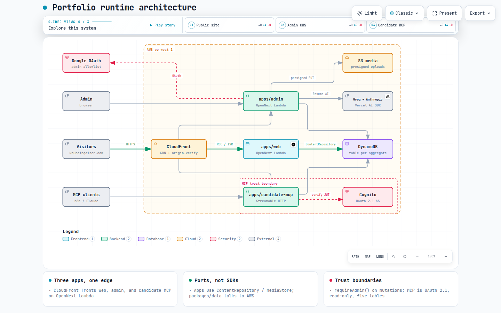
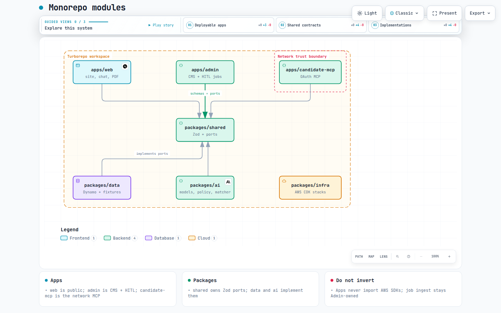
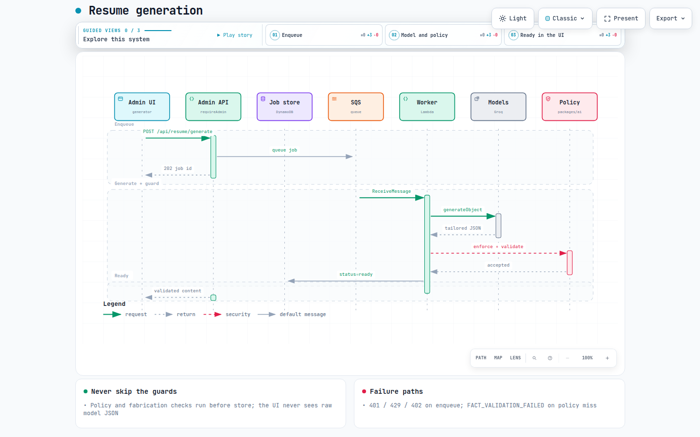
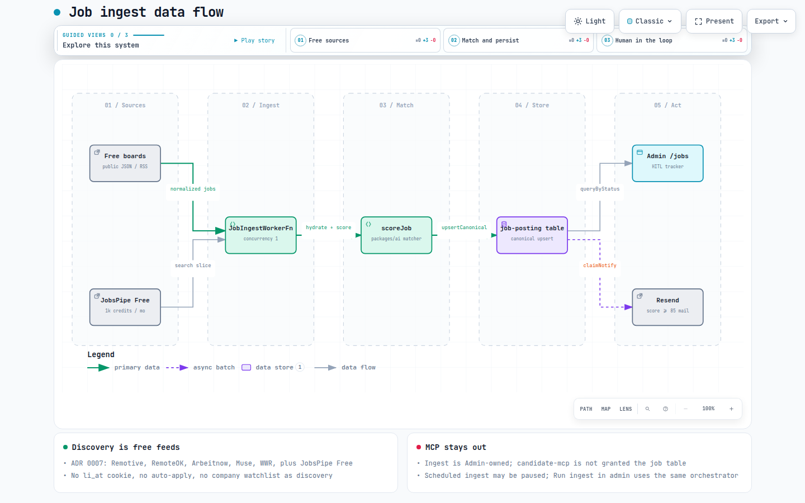
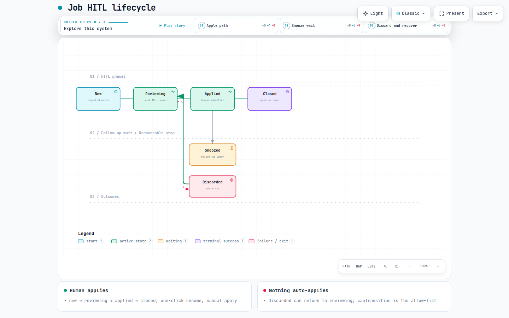
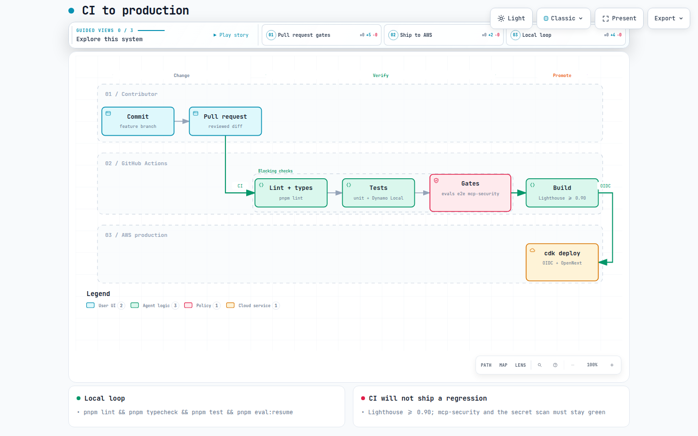

# Portfolio — open-source personal site starter

White-label Turborepo portfolio: a public Next.js site, a private CMS, a read-only MCP server for external agents, and a human-in-the-loop job tracker — running serverless on AWS, defined end-to-end as CDK.

Clone it, set your domain and admin email, replace the demo seed (or edit via admin), and deploy. Committed fixtures use a fictional demo person (`Alex Rivera`); keep your real CV in gitignored `packages/data/seed/content.local.json`.

<p>
  
  
  
  
  
  
</p>

**Interactive architecture maps** (open the HTML in a browser): [runtime](docs/archify/runtime-architecture.html) · [modules](docs/archify/monorepo-modules.html) · [CI](docs/archify/ci-delivery.html) · [resume AI](docs/archify/resume-generation.html) · [job ingest](docs/archify/job-ingest.html) · [HITL](docs/archify/job-hitl.html) · [index](docs/archify/README.md)

---

## Contents

- [What it does](#what-it-does)
- [Architecture](#architecture)
- [Modules](#modules)
- [User journeys](#user-journeys)
- [Quick start](#quick-start)
- [Local development](#local-development)
- [Deploying to AWS](#deploying-to-aws)
- [Candidate Profile MCP](#candidate-profile-mcp-server)
- [Working on this repo](#working-on-this-repo)
- [Environment variables](#environment-variables)
- [Observability and security](#observability--security)
- [License](#license)

---

## What it does

Three runtime surfaces share one data plane:

| Surface                  | Who uses it                   | What it does                                                                        |
| ------------------------ | ----------------------------- | ----------------------------------------------------------------------------------- |
| **`apps/web`**           | Visitors                      | Portfolio, chat (Groq), contact form, resume PDF. Time-based ISR (~10s).            |
| **`apps/admin`**         | Site owner                    | CMS, media uploads, Resume AI, job ingest + HITL tracker. `force-dynamic`.          |
| **`apps/candidate-mcp`** | External agents (n8n, Claude) | Read-only MCP tools over OAuth 2.1 + Cognito. Same public profile data as the site. |

Shared packages own contracts (`packages/shared`), DynamoDB/S3 adapters (`packages/data`), model/policy/matcher (`packages/ai`), the design system and React-PDF resume (`packages/ui`), and every AWS stack (`packages/infra`).

**Hosting:** OpenNext on Lambda + CloudFront. **Data:** DynamoDB, one table per aggregate. **Auth:** Better Auth + Google (stateless cookies, email allowlist). **Media:** S3 + CloudFront. **IaC:** AWS CDK. **CI:** GitHub Actions + OIDC.

---

## Architecture

CloudFront is the edge for all three apps. Apps never import AWS SDKs — they call ports (`ContentRepository`, `MediaStore`, …) implemented in `packages/data`. Admin mutations always call `requireAdmin()`. Candidate MCP is a separate trust boundary: OAuth 2.1, read-only, IAM limited to five content tables.

<picture>
  <source media="(prefers-color-scheme: dark)" srcset="docs/archify/runtime-architecture.dark.png" />
  
</picture>

<p align="center"><sub><a href="docs/archify/runtime-architecture.html">Open the interactive runtime map</a> · pan, zoom, search, light/dark, export</sub></p>

### Why these pieces

- **OpenNext + Lambda + CloudFront** — Next.js 16 (SSR, ISR, RSC streaming, image optimization) on serverless AWS. Scale-to-zero, pay-per-request.
- **Time-based ISR (10s)** — Admin writes DynamoDB; the public site revalidates within the window. No on-demand invalidation, tag cache, SQS, or revalidation Lambda.
- **DynamoDB (table-per-entity)** — On-demand billing, PITR on durable tables, TTL on the rate-limit table.
- **Better Auth (stateless)** — Google OAuth, encrypted cookie sessions, email allowlist on every mutation.
- **Ports and adapters** — The same app code runs against fixtures, DynamoDB Local, or AWS.
- **Groq + Anthropic via the Vercel AI SDK** — Chat and Resume AI. Resume output must pass `enforceResumeGenerationPolicy` and `validateFabrication` before it is stored or shown.

Deeper hosting (CloudFront origins, cache headers, deploy order): [docs/architecture.md](docs/architecture.md). Runtime debug maps: [docs/flows/](docs/flows/README.md). Decisions: [docs/adr/](docs/adr/).

### AWS infrastructure (CDK stacks)

Defined in [`packages/infra`](packages/infra); entry is [`bin/portfolio.ts`](packages/infra/bin/portfolio.ts). Region **`eu-west-1`** unless noted. Custom domain is off by default (`domainEnabled=false`).

| Stack                              | Region      | Contents                                                          |
| ---------------------------------- | ----------- | ----------------------------------------------------------------- |
| `Portfolio-Data`                   | `eu-west-1` | DynamoDB tables, S3 media, AI key secrets                         |
| `Portfolio-Web`                    | `eu-west-1` | OpenNext web: server + image Lambdas, CloudFront, S3 assets/cache |
| `Portfolio-Auth`                   | `eu-west-1` | Better Auth secrets (Google OAuth JSON + signing key)             |
| `Portfolio-Admin`                  | `eu-west-1` | OpenNext admin + job ingest/notify/generation/render workers      |
| `Portfolio-Shared`                 | `eu-west-1` | EventBridge, SNS, SES, CloudWatch alarm + dashboard, Budget       |
| `Portfolio-Storybook`              | `eu-west-1` | Private S3 + CloudFront                                           |
| `Portfolio-Oidc`                   | `eu-west-1` | GitHub Actions OIDC deploy role (`-c githubRepo=`)                |
| `Portfolio-CandidateMcp`           | `eu-west-1` | Cognito OAuth 2.1, Lambda, CloudFront (`domainEnabled=true`)      |
| `Portfolio-Dns` / `Portfolio-Cert` | `us-east-1` | Route 53 + ACM for CloudFront                                     |

Cross-stack wiring uses the **SSM registry**, not CloudFormation exports ([ADR 0001](docs/adr/0001-cross-stack-references.md)).

---

## Modules

<picture>
  <source media="(prefers-color-scheme: dark)" srcset="docs/archify/monorepo-modules.dark.png" />
  
</picture>

<p align="center"><sub><a href="docs/archify/monorepo-modules.html">Open the interactive module map</a></sub></p>

```
portfolio-v2/
├── apps/
│   ├── web/                 # Public site — chat, resume PDF, contact
│   ├── admin/               # CMS — Better Auth, Resume AI, job HITL
│   └── candidate-mcp/       # Network MCP — OAuth 2.1, read-only tools
├── packages/
│   ├── shared/              # Zod schemas, ports, constants
│   ├── data/                # DynamoDB + S3 adapters, fixtures, job feeds
│   ├── ai/                  # Models, prompts, guardrails, matcher, evals
│   ├── ui/                  # Design system + React-PDF + Storybook
│   ├── infra/               # AWS CDK app
│   ├── deploy/              # OpenNext build + smoke tests
│   ├── observability/       # Powertools logger
│   ├── agent-mcp/           # Local, unauthenticated ADR/AI MCP (dev-only)
│   └── eslint-config/
├── specs/                   # Resume AI + job-match acceptance specs
├── docs/adr/                # Architecture decisions
├── docs/flows/              # Runtime maps + debug files
├── docs/archify/            # Interactive architecture diagrams
├── AGENTS.md                # Agent operating manual
└── .github/workflows/       # CI: lint, tests, evals, e2e, Lighthouse, deploy
```

| Package                | Responsibility                                                                |
| ---------------------- | ----------------------------------------------------------------------------- |
| `@portfolio/shared`    | Zod contracts and ports. Apps depend on this, not on AWS.                     |
| `@portfolio/data`      | DynamoDB multi-table adapter, S3 media, free job feeds, fixture backend.      |
| `@portfolio/ai`        | Model factory, Resume AI policy + fabrication checks, job `scoreJob`.         |
| `@portfolio/ui`        | Shared UI and the ATS resume PDF renderer.                                    |
| `@portfolio/infra`     | Every CDK stack.                                                              |
| `@portfolio/agent-mcp` | Local stdio MCP that returns ADRs and AI contracts. Not `apps/candidate-mcp`. |

**Invariants** (do not weaken — see [`AGENTS.md`](AGENTS.md)):

1. Admin mutations call `requireAdmin()`. Middleware is UX only.
2. Resume AI output passes policy + fabrication before the UI sees it.
3. No secrets in source. Secrets Manager ARNs only.
4. No CloudFormation exports between Data/Auth and consumers.
5. Candidate MCP stays read-only and `deepSanitize`s every free-text field.
6. Job discovery is free feeds (ADR 0007), not a LinkedIn session scrape.

---

## User journeys

### Visitor — public site

1. Hit CloudFront → OpenNext web Lambda (HTML/RSC) or hashed `_next` assets on S3.
2. Content pages use `revalidate = 10` against `ContentRepository`.
3. Chat: `POST /api/chat` → rate limit → system prompt from CMS → Groq stream.
4. Contact: Turnstile + Resend. Resume PDF: `@react-pdf/renderer` on a route handler.

Flow notes: [docs/flows/public-chat.md](docs/flows/public-chat.md), [docs/flows/contact.md](docs/flows/contact.md), [docs/flows/cms-content.md](docs/flows/cms-content.md).

### Owner — CMS and Resume AI

Sign in with Google (allowlisted email). Every save goes through `requireAdmin()` then a port. Resume generation is async:

<picture>
  <source media="(prefers-color-scheme: dark)" srcset="docs/archify/resume-generation.dark.png" />
  
</picture>

<p align="center"><sub><a href="docs/archify/resume-generation.html">Open the interactive sequence</a> · spec: <a href="specs/resume-ai.md">specs/resume-ai.md</a></sub></p>

### Owner — job discovery (HITL)

Free boards (Remotive, RemoteOK, Arbeitnow, The Muse, WWR) plus JobsPipe Free are ingested, scored, and upserted. Matches at or above the notify threshold email immediately. Review, tailor, and apply stay human.

<picture>
  <source media="(prefers-color-scheme: dark)" srcset="docs/archify/job-ingest.dark.png" />
  
</picture>

<p align="center"><sub><a href="docs/archify/job-ingest.html">Open the interactive data flow</a> · ADR <a href="docs/adr/0007-job-match-pipeline.md">0007</a> · <a href="specs/job-match.md">specs/job-match.md</a></sub></p>

<picture>
  <source media="(prefers-color-scheme: dark)" srcset="docs/archify/job-hitl.dark.png" />
  
</picture>

<p align="center"><sub><a href="docs/archify/job-hitl.html">Open the interactive lifecycle</a> · statuses: <code>new</code>, <code>reviewing</code>, <code>applied</code>, <code>snoozed</code>, <code>discarded</code>, <code>closed</code></sub></p>

Scheduled ingest may be paused while the matcher is under review. **Run ingest** in admin uses the same `runScheduledIngest()` orchestrator.

### External agent — candidate MCP

OAuth 2.1 client credentials (n8n) or authorization code + PKCE (Claude). Tools: `get_candidate_profile`, `get_candidate_facts`. Both read-only, no arguments, sanitized. Demo: [docs/n8n-candidate-mcp-demo.md](docs/n8n-candidate-mcp-demo.md).

### Contributor — CI to production

<picture>
  <source media="(prefers-color-scheme: dark)" srcset="docs/archify/ci-delivery.dark.png" />
  
</picture>

<p align="center"><sub><a href="docs/archify/ci-delivery.html">Open the interactive workflow</a></sub></p>

---

## Quick start

**Prerequisites:** Node.js ≥ 22, pnpm 10 (`corepack enable`). Docker only if you use `DATA_BACKEND=dynamo`.

```bash
git clone <your-fork-or-upstream-url>
cd portfolio-v2
pnpm install
cp apps/web/.env.example apps/web/.env.local
cp apps/admin/.env.example apps/admin/.env.local
# Optional: keep your real CV private for local fixture mode
# cp packages/data/seed/content.local.example.json packages/data/seed/content.local.json
pnpm dev:web    # http://localhost:3000  (DATA_BACKEND=fixture by default)
```
`pnpm dev:admin` is http://localhost:3001. Fixture mode needs no AWS.

---

## Local development

| Command                                      | Description                              |
| -------------------------------------------- | ---------------------------------------- |
| `pnpm dev`                                   | All apps                                 |
| `pnpm dev:web` / `pnpm dev:admin`            | Public site / CMS                        |
| `pnpm lint` / `pnpm typecheck` / `pnpm test` | ESLint, `tsc --noEmit`, Vitest           |
| `pnpm eval:resume`                           | Offline Resume AI fixtures (no API keys) |
| `pnpm test:e2e`                              | Playwright (public site, fixture mode)   |
| `pnpm ddb:up` / `pnpm ddb:down`              | DynamoDB Local                           |
| `pnpm --filter @portfolio/data seed`         | Idempotent seed from fixtures            |
| `pnpm --filter @portfolio/candidate-mcp dev` | Candidate MCP over stdio                 |
| `pnpm --filter @portfolio/agent-mcp start`   | Local ADR/AI MCP                         |

The change loop that CI expects:

```bash
pnpm lint && pnpm typecheck && pnpm test && pnpm eval:resume
```

`DATA_BACKEND=fixture` (default) is static JSON. `DATA_BACKEND=dynamo` needs DynamoDB Local (`pnpm ddb:up`) or real tables.

---

## Deploying to AWS

Everything is CDK. Bootstrap once, then build OpenNext bundles and deploy. `Portfolio-Data` must exist first so SSM has `/portfolio/data/media-public-base-url`.

```bash
cd packages/infra
pnpm exec cdk bootstrap aws://<ACCOUNT_ID>/eu-west-1

pnpm build:open-next   # from repo root; also builds Storybook

cd packages/infra
pnpm exec cdk deploy \
  Portfolio-Data Portfolio-Auth Portfolio-Web Portfolio-Admin Portfolio-Shared Portfolio-Storybook \
  --require-approval never \
  -c adminUrls=https://<admin-distribution>.cloudfront.net \
  -c alertEmail=you@example.com \
  -c contactEmail=you@example.com
```

On first deploy, run `Portfolio-Admin` once to get the CloudFront URL, then re-run with `-c adminUrls=<that URL>` so `APP_ORIGIN` and Google OAuth redirects match. Optional: `pnpm smoke-test:images`.

### Secrets (inject out-of-band)

CDK creates empty secret shells and publishes ARNs to SSM. Put values with `aws secretsmanager put-secret-value`.

| Secret                                                    | Used by                               |
| --------------------------------------------------------- | ------------------------------------- |
| `/portfolio/google-oauth` (`{"clientId","clientSecret"}`) | Admin Better Auth                     |
| `/portfolio/better-auth-secret`                           | Admin session signing (CDK generates) |
| `/portfolio/groq-api-key`                                 | Web chat + Admin Resume AI            |
| `/portfolio/anthropic-api-key`                            | Admin Resume AI                       |
| `/portfolio/resend-api-key`                               | Web contact form                      |
| `/portfolio/turnstile-secret-key`                         | Web contact form                      |

Google OAuth redirect: `https://<admin-origin>/api/auth/callback/google` (and `http://localhost:3001/api/auth/callback/google`). Authorized JavaScript origin = admin origin.

GitHub variables for deploy include `CONTACT_EMAIL`, `CONTACT_FROM_EMAIL`, `NEXT_PUBLIC_SITE_URL`, `NEXT_PUBLIC_TURNSTILE_SITE_KEY`, PostHog `NEXT_PUBLIC_POSTHOG_*`, `DOMAIN_ENABLED`, and **`DOMAIN_NAME`** (apex domain, e.g. `example.com` — **required** when `DOMAIN_ENABLED=true`). `POSTHOG_API_KEY` is a GitHub **secret** (source-map upload).

CI passes `-c domainName=${{ vars.DOMAIN_NAME }}` into every CDK deploy and injects `NEXT_PUBLIC_SITE_URL` into the OpenNext build so canonical URLs are not baked from a personal fallback.

### Custom domain

1. Set GitHub variable `DOMAIN_NAME` to your apex (e.g. `example.com`) and `NEXT_PUBLIC_SITE_URL` to `https://<apex>`.
2. `cdk deploy Portfolio-Dns -c domainName=<apex>` — delegate nameservers.
3. `cdk deploy Portfolio-Cert -c domainEnabled=true -c domainName=<apex>` — wait for ACM.
4. `cdk deploy --all -c domainEnabled=true -c domainName=<apex>`.

Search Console Domain verification is a Route 53 apex TXT record via GitHub variable `GOOGLE_DNS_SITE_VERIFICATION` (`google-site-verification=…`). Do not put that string in a page meta tag.

### Seed content (do not wipe production by accident)

Committed demo: [`packages/data/seed/content.json`](packages/data/seed/content.json) (fictional **Alex Rivera**).

Private CV for local fixture mode: copy to `packages/data/seed/content.local.json` (gitignored). See `content.local.example.json`.

```bash
# Seeds the committed demo — refuses table prefix "portfolio" unless you pass the wipe flag.
DATA_BACKEND=dynamo DYNAMO_TABLE_PREFIX=portfolio-dev AWS_REGION=eu-west-1 \
  pnpm --filter @portfolio/data seed -- --file packages/data/seed/content.json

# Your private CV into a non-prod prefix:
DATA_BACKEND=dynamo DYNAMO_TABLE_PREFIX=portfolio-dev AWS_REGION=eu-west-1 \
  pnpm --filter @portfolio/data seed -- --file packages/data/seed/content.local.json

# Production prefix requires an explicit acknowledgement (clears list tables):
# DATA_BACKEND=dynamo DYNAMO_TABLE_PREFIX=portfolio AWS_REGION=eu-west-1 \
#   pnpm --filter @portfolio/data seed -- --file packages/data/seed/content.local.json \
#   --i-understand-this-wipes-tables
```

**Git history note:** older commits may still contain personal PII. Replacing files does not scrub history. If you publish a public fork, treat history rewrite / a fresh orphan branch as a separate ops task.
---

## Candidate Profile MCP server

[`apps/candidate-mcp`](apps/candidate-mcp) is **network-reachable** and OAuth-authenticated. [`packages/agent-mcp`](packages/agent-mcp) is **local, unauthenticated, stdio**. Different trust boundaries ([ADR 0003](docs/adr/0003-candidate-mcp-server.md), [ADR 0006](docs/adr/0006-candidate-mcp-oauth.md)).

- **Transport:** MCP Streamable HTTP, Lambda Function URL behind CloudFront on `mcp.<domain>` (`domainEnabled=true`).
- **Auth:** Cognito as authorization server. Public `/.well-known` PRM + AS metadata. Interactive clients: authorization code + PKCE. n8n/CI: client_credentials (secret in Secrets Manager).
- **Tools:** `get_candidate_profile`, `get_candidate_facts`. Read-only, no arguments, `deepSanitize` on free text.
- **Isolation:** CloudFront origin-verify, JWT verification, per-IP rate limits, DCR redirect allowlist, IAM on five content tables only. Function URL OAC is not used (it collides with `Authorization: Bearer`).
- Job matching stays **Admin-owned**. Do not grant the job table to candidate-mcp. Any write-capable MCP tool needs its own ADR.

---

## Working on this repo

This repo is operated with a committed agent interface:

- [`AGENTS.md`](AGENTS.md) / [`.github/copilot-instructions.md`](.github/copilot-instructions.md) — invariants.
- [`.cursor/rules/`](.cursor/rules/) — scoped rules (`ai-product`, `admin-auth`, `infra`).
- [`packages/agent-mcp`](packages/agent-mcp) — local MCP for ADRs and AI contracts (`.cursor/mcp.json`).
- [`.agents/skills/archify`](.agents/skills/archify) — Archify skill used to generate [docs/archify/](docs/archify/README.md). Cursor loads it via [`.cursor/skills/archify`](.cursor/skills/archify).
- [`specs/resume-ai.md`](specs/resume-ai.md) + [`packages/ai/src/evals/`](packages/ai/src/evals/) — offline evals on every PR.

When a runtime path is broken, start at [docs/flows/](docs/flows/README.md) (files to open, CloudWatch `service` names). For Resume AI, update the spec and add an eval case **before** changing prompts or policy. For job matching, update `specs/job-match.md` and ADR 0007 first.

### CI/CD

[`.github/workflows/ci.yml`](.github/workflows/ci.yml): lint (including Prettier) → typecheck → unit tests → DynamoDB Local integration → Gitleaks → offline Resume AI evals → Playwright e2e → **mcp-security** (auth/sanitize/rate-limit + `CandidateMcpStack` CDK assertions), then build → Lighthouse desktop + mobile (≥ 0.90) → deploy on push to `main` via OIDC. Do not relax Lighthouse to go green.

---

## Environment variables

Copy **`apps/web/.env.example`** and **`apps/admin/.env.example`** to **`.env.local`**. In production, CDK injects these on Lambda.

### Web

| Variable                                                   | Purpose                        |
| ---------------------------------------------------------- | ------------------------------ |
| `NEXT_PUBLIC_SITE_URL`                                     | Canonical URL                  |
| `GROQ_API_KEY_SECRET_ARN`                                  | Groq key (Secrets Manager ARN) |
| `RESEND_API_KEY` / `RESEND_API_KEY_SECRET_ARN`             | Contact form                   |
| `TURNSTILE_SECRET_KEY` / `TURNSTILE_SECRET_KEY_SECRET_ARN` | Turnstile server verify        |
| `NEXT_PUBLIC_TURNSTILE_SITE_KEY`                           | Invisible widget               |
| `CONTACT_TO_EMAIL` / `CONTACT_FROM_EMAIL`                  | Recipient / Resend from        |
| `DATA_BACKEND`                                             | `fixture` or `dynamo`          |
| `DYNAMO_TABLE_PREFIX`                                      | Default `portfolio`            |
| `NEXT_PUBLIC_POSTHOG_*`                                    | Client + server analytics      |

### Admin

| Variable                                                            | Purpose                         |
| ------------------------------------------------------------------- | ------------------------------- |
| `GOOGLE_OAUTH_SECRET_ARN` / `BETTER_AUTH_SECRET_ARN` / `APP_ORIGIN` | Better Auth + Google            |
| `ADMIN_ALLOWED_EMAILS`                                              | Allowlist (required at runtime) |
| `GROQ_API_KEY_SECRET_ARN` / `ANTHROPIC_API_KEY_SECRET_ARN`          | Resume AI                       |
| `S3_MEDIA_BUCKET` / `MEDIA_PUBLIC_BASE_URL`                         | Media uploads                   |
| `DATA_BACKEND` / `DYNAMO_TABLE_PREFIX`                              | Data layer                      |

---

## Observability & security

- **CloudWatch:** `AppErrors` from structured `{ $.level = "ERROR" }`; dashboard `Portfolio-overview` in `Portfolio-Shared`. Prod web/admin log level is **WARN** ([ADR 0002](docs/adr/0002-cost-optimization.md)).
- **PostHog:** pageviews, product events, `$exception` with source maps.
- **Auth:** session verification + allowlist on every mutation.
- **Resume AI:** prompt-injection stripping, Zod `.strict()` output, rate limits, daily USD cap.

---

## Author

Originally built by **Khubaib Qaiser**. Forks should substitute their own identity via admin CMS / `content.local.json`, not by editing application code.

---

## License

[MIT](./LICENSE). Copyright (c) 2024-present Khubaib Qaiser.