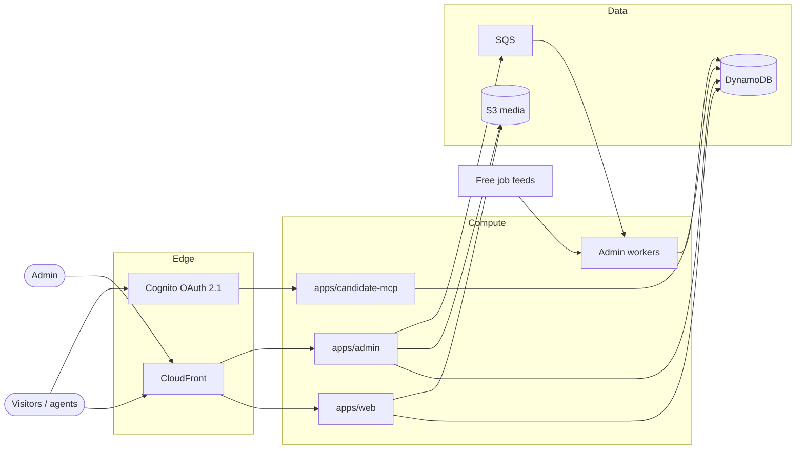

# Portfolio — [khubaibqaiser.com](https://khubaibqaiser.com)

Production portfolio platform for **Khubaib Qaiser**: a public Next.js site, a private CMS, and a network-facing MCP server for candidate automation — all defined as AWS infrastructure-as-code and operated with an AI-native agent harness.

Built as a **Turborepo + pnpm** monorepo. Apps run on **OpenNext** (AWS Lambda + CloudFront). Content lives in **DynamoDB**. Admin auth is **Better Auth** (Google, stateless sessions). Media is on **S3**. The full platform — DNS, certs, alarms, budgets, and the CI deploy role — is provisioned with **AWS CDK**.

|                   |                                                                          |
| ----------------- | ------------------------------------------------------------------------ |
| **Live site**     | [khubaibqaiser.com](https://khubaibqaiser.com)                           |
| **System map**    | [docs/archify/portfolio-system.html](docs/archify/portfolio-system.html) |
| **Runtime flows** | [docs/flows/](docs/flows/README.md)                                      |
| **Decisions**     | [docs/adr/](docs/adr/)                                                   |
| **License**       | Proprietary — see [LICENSE](./LICENSE)                                   |

---

## Highlights

- **Serverless Next.js 16** — App Router, RSC, streaming, and time-based ISR on Lambda + CloudFront via OpenNext.
- **Ports & adapters** — apps depend on `ContentRepository`, `MediaStore`, and related ports, not AWS SDKs. Local fixtures and DynamoDB Local share the same contracts as production.
- **CMS with real auth** — Better Auth + Google, email allowlist, and `requireAdmin()` on every mutation (middleware is UX only).
- **Resume AI with guardrails** — structured model output must pass fabrication policy and offline evals before it reaches the UI.
- **Candidate MCP** — OAuth 2.1 (Cognito) Streamable HTTP MCP for external automation; read-only tools, scrubbed output, five-table IAM (ADR 0003 / 0006).
- **Job matching (Admin-owned)** — free job feeds + JobsPipe Free; no LinkedIn session scrape, no auto-apply (ADR 0007).
- **AI-native operations** — `AGENTS.md`, scoped Cursor rules, local agent MCP, Archify system map, and a Graphify knowledge graph kept current by git hooks.
- **Production CI** — lint, typecheck, unit + integration tests, Gitleaks, Resume AI evals, Playwright, candidate-MCP security, Lighthouse, then OIDC deploy to AWS.

---

## Architecture


```mermaid
flowchart LR
  visitors([Visitors / agents])
  adminUser([Admin])

  subgraph edge [Edge]
    cf[CloudFront]
    cognito[Cognito OAuth 2.1]
  end

  subgraph compute [Compute]
    web[apps/web]
    admin[apps/admin]
    mcp[apps/candidate-mcp]
    workers[Admin workers]
  end

  subgraph data [Data]
    ddb[(DynamoDB)]
    media[(S3 media)]
    sqs[SQS]
  end

  feeds[Free job feeds]

  visitors --> cf --> web
  visitors --> cognito --> mcp
  adminUser --> cf --> admin
  web --> ddb
  web --> media
  admin --> ddb
  admin --> media
  admin --> sqs --> workers
  workers --> ddb
  mcp --> ddb
  feeds --> workers
```

Interactive map (evidence-pinned to the repo):  
**[docs/archify/portfolio-system.html](docs/archify/portfolio-system.html)**  
Source: [`docs/archify/portfolio-system.architecture.json`](docs/archify/portfolio-system.architecture.json).

Deeper hosting and cache behavior: [docs/architecture.md](docs/architecture.md).  
Debug-oriented runtime flows (ingest, notify, resume AI, chat, MCP, CMS): [docs/flows/](docs/flows/README.md).

### Design choices

| Choice                             | Why                                                                                 |
| ---------------------------------- | ----------------------------------------------------------------------------------- |
| OpenNext on Lambda + CloudFront    | Full Next.js 16 (SSR, ISR, RSC streaming, image optimization) with scale-to-zero    |
| Time-based ISR (`revalidate = 10`) | Simple freshness without on-demand invalidation, tag cache, or revalidation Lambdas |
| Table-per-entity DynamoDB          | Readable keys, on-demand billing, PITR on durable tables                            |
| Better Auth (stateless)            | Google OAuth for admin without an auth database                                     |
| SSM registry (not CFN exports)     | Cross-stack wiring without brittle `Fn::ImportValue` (ADR 0001)                     |
| Symptom-based CloudWatch alarms    | Cost-aware observability (ADR 0002)                                                 |

### CDK stacks

Defined in [`packages/infra`](packages/infra). Default app region: **`eu-west-1`**. DNS/certs: **`us-east-1`**.

| Stack                               | Purpose                                                           |
| ----------------------------------- | ----------------------------------------------------------------- |
| `Portfolio-Data`                    | DynamoDB, S3 media, AI/email secret shells                        |
| `Portfolio-Web` / `Portfolio-Admin` | OpenNext sites (server + image Lambdas, CloudFront, assets/cache) |
| `Portfolio-Auth`                    | Better Auth / Google OAuth secrets                                |
| `Portfolio-Shared`                  | EventBridge, SNS, SES, CloudWatch, budget                         |
| `Portfolio-CandidateMcp`            | Cognito + Lambda + CloudFront MCP (`domainEnabled=true`)          |
| `Portfolio-Storybook`               | Private static Storybook                                          |
| `Portfolio-Oidc`                    | GitHub Actions deploy role                                        |
| `Portfolio-Dns` / `Portfolio-Cert`  | Route 53 + ACM (opt-in custom domain)                             |

Custom domain is **off by default** (`domainEnabled=false`); both apps use `*.cloudfront.net` until DNS is delegated.

---

## Repository layout

```
portfolio-v2/
├── apps/
│   ├── web/              # Public site — chat, resume PDF, contact
│   ├── admin/            # CMS — auth, editors, media, job triage
│   └── candidate-mcp/    # Network MCP — OAuth 2.1, read-only tools
├── packages/
│   ├── shared/           # Zod schemas + ports
│   ├── data/             # DynamoDB / fixture adapters + seed
│   ├── ai/               # Models, prompts, guardrails, evals
│   ├── ui/               # Design system + Storybook
│   ├── infra/            # AWS CDK
│   ├── deploy/           # OpenNext build + smoke helpers
│   ├── observability/    # Shared logging/metrics helpers
│   ├── agent-mcp/        # Local read-only MCP (ADRs + AI contracts)
│   └── eslint-config/
├── docs/
│   ├── adr/              # Architecture Decision Records
│   ├── flows/            # Runtime debug maps
│   └── archify/          # Live system map (JSON + HTML)
├── graphify-out/         # Knowledge graph (graph.json)
├── specs/                # Product acceptance specs
├── .agents/skills/       # Archify + Graphify skill packages
├── .githooks/            # Graphify post-commit / post-checkout
├── AGENTS.md             # Agent operating manual
└── .github/workflows/    # CI/CD
```

---

## Quick start

**Prerequisites:** Node.js ≥ 22, pnpm 10 (`corepack enable`), Docker only if you use DynamoDB Local.

```bash
git clone https://github.com/KhubaibQaiser/portfolio-v2.git
cd portfolio-v2
pnpm install
cp apps/web/.env.example apps/web/.env.local
cp apps/admin/.env.example apps/admin/.env.local

# Optional: enable committed Graphify hooks
git config core.hooksPath .githooks
graphify hook install   # requires: uv tool install graphifyy

pnpm dev:web    # http://localhost:3000
pnpm dev:admin  # http://localhost:3001
```

Default `DATA_BACKEND=fixture` runs the UI with no AWS credentials.

| Command                              | Purpose                                |
| ------------------------------------ | -------------------------------------- |
| `pnpm dev` / `dev:web` / `dev:admin` | Local apps                             |
| `pnpm build`                         | Production build                       |
| `pnpm lint` / `pnpm typecheck`       | Static checks                          |
| `pnpm test`                          | Unit tests                             |
| `pnpm test:integration`              | DynamoDB Local (`pnpm ddb:up` first)   |
| `pnpm eval:resume`                   | Offline Resume AI evals (no live LLM)  |
| `pnpm test:e2e`                      | Playwright (public site, fixture mode) |
| `pnpm --filter @portfolio/data seed` | Seed DynamoDB from fixtures            |

---

## Deploy (AWS)

Everything is CDK. OpenNext artifacts must be built before the web/admin stacks:

```bash
pnpm build:open-next

cd packages/infra
pnpm exec cdk bootstrap aws://<ACCOUNT_ID>/eu-west-1
pnpm exec cdk deploy \
  Portfolio-Data Portfolio-Auth Portfolio-Web Portfolio-Admin Portfolio-Shared Portfolio-Storybook \
  --require-approval never \
  -c adminUrls=https://<admin-distribution>.cloudfront.net \
  -c alertEmail=you@example.com \
  -c contactEmail=you@example.com
```

On first admin deploy, capture the CloudFront URL and redeploy with `-c adminUrls=<that URL>` so OAuth redirects and `APP_ORIGIN` match.

**Secrets** are created as empty shells by CDK and filled out-of-band (never committed):

| Secret                                                         | Used by          |
| -------------------------------------------------------------- | ---------------- |
| `/portfolio/google-oauth`, `/portfolio/better-auth-secret`     | Admin auth       |
| `/portfolio/groq-api-key`, `/portfolio/anthropic-api-key`      | Chat + Resume AI |
| `/portfolio/resend-api-key`, `/portfolio/turnstile-secret-key` | Contact form     |

See `apps/*/.env.example` for local variables and [docs/architecture.md](docs/architecture.md) for deploy ordering. Seed production content with:

```bash
DATA_BACKEND=dynamo DYNAMO_TABLE_PREFIX=portfolio AWS_REGION=eu-west-1 \
  pnpm --filter @portfolio/data seed
```

**Custom domain:** deploy `Portfolio-Dns` → `Portfolio-Cert -c domainEnabled=true` → `cdk deploy --all -c domainEnabled=true`.

---

## Candidate MCP

[`apps/candidate-mcp`](apps/candidate-mcp) exposes the public candidate profile to external automation (n8n, Claude, Inspector) over MCP Streamable HTTP.

- **Auth:** OAuth 2.1 resource server (Cognito) — ADR 0006. Public PRM + AS metadata; Bearer JWT required for tools.
- **Tools:** `get_candidate_profile`, `get_candidate_facts` — read-only, argument-free, scrubbed for prompt injection.
- **Isolation:** CloudFront origin-verify, per-IP rate limits, DCR redirect allowlist, IAM limited to five content tables.
- **Not** the same as [`packages/agent-mcp`](packages/agent-mcp) (local, unauthenticated, for coding agents).

Local: `pnpm --filter @portfolio/candidate-mcp dev`  
Walkthrough: [docs/n8n-candidate-mcp-demo.md](docs/n8n-candidate-mcp-demo.md)

Job discovery stays on Admin workers and free feeds — not in MCP (ADR 0007, [`specs/job-match.md`](specs/job-match.md)).

---

## Agent harness & architecture tooling

This repository is meant to be operated by coding agents as well as humans.

| Surface                                            | Role                                                                        |
| -------------------------------------------------- | --------------------------------------------------------------------------- |
| [`AGENTS.md`](AGENTS.md)                           | Non-negotiable invariants (admin auth, Resume AI policy, IaC, MCP, jobs)    |
| [`.cursor/rules/`](.cursor/rules/)                 | Scoped rules (`admin-auth`, `ai-product`, `infra`, Archify, Graphify)       |
| [`packages/agent-mcp`](packages/agent-mcp)         | Local MCP: ADRs + AI contracts (`pnpm --filter @portfolio/agent-mcp start`) |
| [`specs/resume-ai.md`](specs/resume-ai.md) + evals | Acceptance criteria; `pnpm eval:resume` on every PR                         |
| **Archify**                                        | Evidence-backed system map under `docs/archify/`                            |
| **Graphify**                                       | Code knowledge graph at `graphify-out/graph.json`                           |

### Keep maps current

```bash
# After topology changes (apps, stacks, ports, trust boundaries):
node .agents/skills/archify/bin/archify.mjs deliver architecture \
  docs/archify/portfolio-system.architecture.json \
  docs/archify/portfolio-system.html \
  --quality showcase --repo-root .

# After code changes (or rely on the post-commit hook):
graphify update .
graphify query "How does requireAdmin protect mutations?"
```

---

## CI/CD

[`.github/workflows/ci.yml`](.github/workflows/ci.yml) runs on every PR:

1. Lint (ESLint + Prettier) · Typecheck · Unit tests · DynamoDB Local integration
2. Gitleaks · Resume AI evals · Playwright e2e · Candidate-MCP security (auth / sanitize / rate-limit + CDK synth)
3. Build → Lighthouse (desktop + mobile)
4. On `main`: OIDC deploy to AWS, then optional live MCP smoke when `DOMAIN_ENABLED` is set

Configure repository variables for region, deploy role ARN, admin/site URLs, contact/Turnstile/PostHog, and domain flags. Never put secrets in source — use Secrets Manager ARNs and GitHub secrets only where required (e.g. PostHog source-map upload).

---

## Security posture

- Admin mutations call `requireAdmin()`; DynamoDB has no row-level security.
- Resume AI output is policy-checked and fabrication-validated before UI use.
- Candidate MCP tools are read-only, sanitized, and IAM-scoped to five content tables.
- No LinkedIn `li_at` / session scrape; no auto-apply.
- Secrets stay in Secrets Manager; tokens and session cookies are never logged.

---

## Author

**Khubaib Qaiser** — Senior Software Engineer

- [khubaibqaiser.com](https://khubaibqaiser.com)
- [github.com/KhubaibQaiser](https://github.com/KhubaibQaiser)
- [linkedin.com/in/khubaib-qaiser](https://linkedin.com/in/khubaib-qaiser)

---

## License

Proprietary. All rights reserved. View-only for educational or reference purposes. See [LICENSE](./LICENSE).
