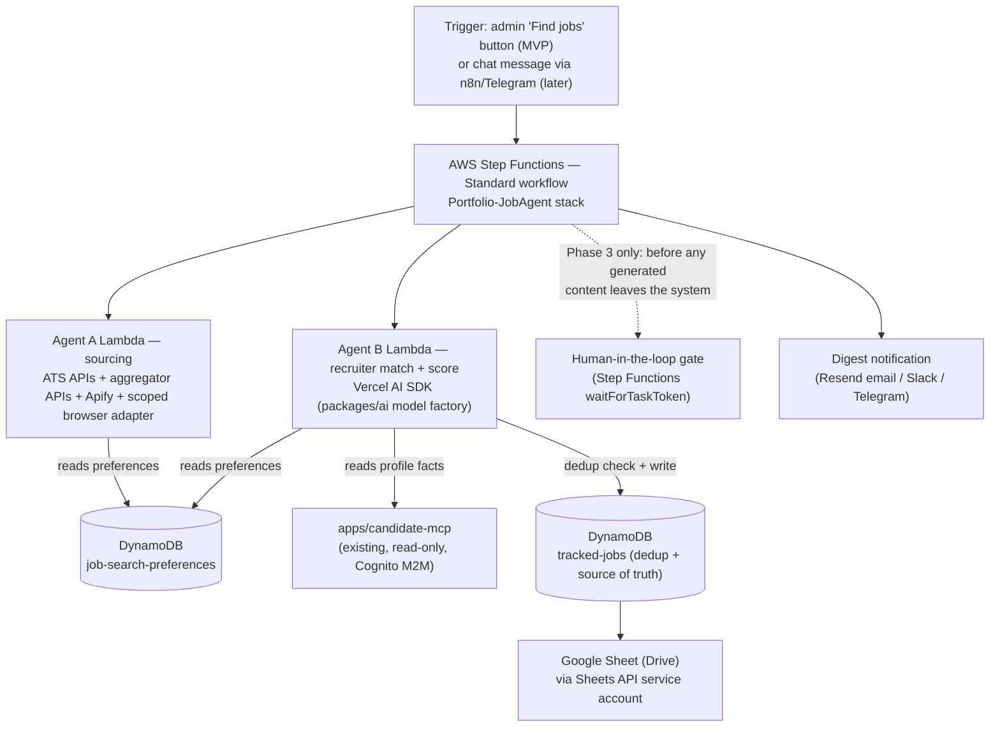

# ADR 0005 — Job-search automation (Phase 2): preferences, sourcing, matching, and tracking

- **Status:** Proposed (planning/research ADR — no code lands until a
  follow-up ADR-scoped PR implements a specific slice; see "Consequences →
  Follow-up" below)
- **Date:** 2026-08-23
- **Deciders:** Khubaib (with AI pairing)

## Context

[ADR 0003](0003-candidate-mcp-server.md) shipped `apps/candidate-mcp`
specifically as "the foundation for a later job-matching/tailored-application
pipeline" and wrote down standing invariants for exactly this moment: no SSRF
surface, output sanitization, and **any write-capable tool needs its own ADR
and a human-review gate**. This ADR is that gate for the next phase, requested
scope:

1. Use the live `candidate-mcp` server to read profile data, plus a new
   **user-configurable preferences** surface (job type, employment type,
   relocation, compensation range/period, and other filters).
2. **Agent A** — source job postings from multiple job boards (public and
   private/credentialed), configurably.
3. **Agent B** — act as a recruiter, match postings against the candidate's
   data and preferences, score fit, and write rows to a **Google Sheet on
   Drive** for tracking.
4. **Phase 3 (not this ADR):** generate a tailored ATS resume, cover letter,
   and LinkedIn outreach message per job.
5. Runs "with a message like 'find jobs'" — i.e. an on-demand, autonomous,
   multi-agent trigger — on free/near-free infrastructure.

This ADR does the research this repo's process requires before touching any
of it: a technology comparison with tradeoffs, a recommendation, a concrete
data/architecture shape consistent with ADR 0001/0002/0003/0004, and a gap
list ("what's missing") for a secure, autonomous system.

**A note on scope discipline:** this ADR does not implement anything. Per
ADR 0003 §"Standing invariants," Phase 2's write-capable pieces (a new
preferences store, a Google Sheet writer) and Phase 3's LLM-generation pieces
each need their own follow-up PR against the design below, gated the same way
`enforceResumeGenerationPolicy` gates resume output today. Nothing here
authorizes skipping that.

## Decision (recommended architecture)

### 0. High-level shape



Nothing here is a new AWS account, a new hosting platform, or a persistent
server. It is one more CDK stack (`Portfolio-JobAgent`) alongside
`Portfolio-CandidateMcp`, following the exact same isolation pattern: its own
least-privilege IAM, its own Cognito app client (`job-agent`, scope
`profile.read`) to call `candidate-mcp` like any other consumer, and its own
kill switch env var (`JOB_AGENT_ENABLED`, mirroring `MCP_ENABLED`).

### 1. Orchestration engine: AWS Step Functions + Lambda, not a new runtime

**Recommendation: AWS Step Functions (Standard workflow)**, with each agent as
a plain TypeScript Lambda using the same Vercel AI SDK model factory
`packages/ai` already has, not a new Python agent framework and not n8n as
the *logic* layer (n8n stays useful as a thin *trigger/notify* layer — see
§5).

| Option | Cost at this scale | Human-in-the-loop | Fits existing stack | Verdict |
| --- | --- | --- | --- | --- |
| **AWS Step Functions (Standard) + Lambda** | Free tier: 4,000 state transitions/mo; a daily run with ~15 states consumes ~450 transitions/mo — comfortably free. `waitForTaskToken` pauses **at zero compute cost** for up to a year. | **Native `waitForTaskToken`** — pause, persist, resume from a callback (email link, admin-app button). First-class, not a workaround. | AWS-native, same account, same CDK app, same ARN/SSM patterns (ADR 0001), same IAM-per-Lambda discipline (ADR 0003). Zero new packages: agents are TS Lambdas using `packages/ai`. | **Recommended.** |
| **n8n (self-hosted, Community Edition)** | Free software, but needs an always-on host: free-tier candidates are a shrinking Oracle Cloud Ampere A1 VM (now 2 OCPU/12 GB, down from 4/24 in 2026) or a paid VPS (~€5–20/mo). | Supported via wait/webhook nodes, but not first-class — you build the pause/resume by hand with a webhook node + external state. | Already the Phase 1 consumer (ADR 0003's n8n demo) — reuses familiarity. But business logic lives in an un-versioned visual canvas, hard to unit-test, and mixing it with this repo's "ports & adapters, offline-eval" culture (`pnpm eval:resume`) is a step backward. | Good for the *trigger/notify* edge, not the orchestrator. |
| **n8n Cloud** | €20–24/mo minimum (Starter, 2,500 executions) | Same as self-hosted n8n | Removes the ops burden of self-hosting, but is a recurring paid line for a "free infra" goal. | Rejected — not free, and same logic-in-canvas concern. |
| **LangGraph (TS or Python) self-hosted on Lambda/Fargate** | Free framework; hosting cost = whatever compute it runs on (Lambda works for short graphs; long ones want Fargate, which is not in this repo's always-free footprint). | **Best-in-class** `interrupt()`/`Command` primitive — purpose-built for exactly this. | If Python: a second language in a 100%-TypeScript monorepo, a new package boundary AGENTS.md says not to add "unless the task is a new bounded concern" — arguable, but adds real weight for a personal project. If TS (`@langchain/langgraph`), it's viable, but Step Functions gets equivalent HITL for free with no new dependency at all. | Reasonable alternative if the graph logic gets complex enough that Step Functions' JSON state language becomes unwieldy — revisit if agent count grows past ~5–6 steps with heavy branching. |
| **CrewAI** | Free framework (Python) | Basic, not first-class — needs custom wrappers for approval gates | Python-only, no native TS bindings; same monorepo-language objection as LangGraph-Python, more so since HITL (a hard requirement here per ADR 0003) is *weaker* than LangGraph's. | Rejected. |
| **AutoGen / AG2 / Microsoft Agent Framework** | Free framework (Python) | Manual (`CancellationToken` is a graceful-stop, not a resumable interrupt) | Conversational multi-agent (agents debating) is the wrong shape for a linear source → match → gate → notify pipeline; also Python. | Rejected. |
| **Temporal (self-hosted or Cloud)** | Self-hosted needs Postgres/Cassandra + workers — real ops for a personal project; Temporal Cloud has no meaningful always-free tier. | Excellent (signals, durable timers), but over-built for this workload. | Enterprise-grade durability this project's ~$5/mo budget (ADR 0002) doesn't need. | Rejected — right tool for a bigger job. |
| **Plain cron Lambda + `EventBridge Scheduler`, no state machine** | Free (EventBridge Scheduler's first 14M invocations/mo free) | None — a single Lambda can't pause and resume; you'd hand-roll a callback table, badly reinventing what Step Functions already gives you. | Simplest possible, but re-implements approval-gate plumbing from scratch. | Rejected for the multi-step pipeline; fine for the trigger tick itself (see §5). |

Step Functions Standard is the only option on this list that gives durable,
zero-cost, spec-correct human-in-the-loop pausing **without adding a new
language, a new always-on host, or a new paid subscription** — which is
exactly this repo's existing bias (ADR 0001's "boring managed service," ADR
0003's Cognito choice for the same reason). Each state is a Lambda; heavy
steps (headless browser) use container-image Lambdas exactly like ADR 0004's
LaTeX renderer precedent, not a new compute platform.

### 2. Preferences: a new DynamoDB singleton behind a port, editable in `apps/admin`, readable by agents via one new read-only `candidate-mcp` tool

Preferences are configuration, not candidate content — they get their own
port rather than overloading `ContentRepository`:

```typescript
// packages/shared/src/ports/job-search-preferences.ts (proposed — not yet implemented)
export type JobSearchPreferences = {
  jobTypes: Array<"remote" | "hybrid" | "onsite">;
  employmentTypes: Array<"w2" | "c2c" | "1099" | "contract-to-hire" | "full-time-perm">;
  relocation: { willing: boolean; locations?: string[] };
  compensation: {
    period: "hourly" | "monthly" | "annually";
    min: number;
    max?: number;
    currency: string; // ISO 4217, e.g. "USD"
  };
  titles: string[]; // must-match-one keyword set, e.g. ["Senior Software Engineer", "Staff Engineer"]
  seniority: Array<"mid" | "senior" | "staff" | "principal">;
  excludedCompanies: string[]; // staffing agencies, competitors, past employers
  excludedKeywords: string[]; // e.g. "clearance required", "unpaid"
  visaSponsorshipRequired: boolean;
  timezoneConstraints?: string[]; // many "remote" US postings are region-restricted
  maxJobAgeDays: number;
  enabledSources: string[]; // per-board opt-in allowlist, see §3
};

export type JobSearchPreferencesRepository = {
  get(): Promise<JobSearchPreferences>;
  upsert(values: Partial<JobSearchPreferences>): Promise<void>;
};
```

- **Storage:** one more singleton in the `content` table (same pattern as
  `hero`/`about`/`site-config`, keyed by `section = "job-search-preferences"`)
  — no new table, no new stack for this piece.
- **Editing UX:** a new `apps/admin` form (React Hook Form + Zod, same as
  every other content editor), gated by the existing `requireAdmin()` — this
  is the "user configurable preferences" UI the task asks for, and it needs
  **no new trust boundary**: it is exactly as sensitive as the resume/about
  editors already behind admin auth.
- **Agent visibility:** add one more read-only, no-argument tool to
  `apps/candidate-mcp` — `get_job_search_preferences` — following the exact
  shape of `get_candidate_facts`: same `withGuardrails` wrapper, same
  `deepSanitize` pass, same per-`client_id` rate limit, same tight IAM (one
  more table added to `grantCandidateMcpDataAccess`'s explicit five-table
  list, not a wildcard). This keeps "read candidate/preference data" on the
  one already-audited, spec-compliant, OAuth-protected trust boundary instead
  of inventing a second one for Agent A/B to call.

### 3. Agent A — sourcing: prefer official/public JSON APIs, treat scraping as a fallback, never touch login-walled boards from inside `candidate-mcp`

Ranked by legal risk, reliability, and cost — lowest risk and least
maintenance first:

| Source class | Examples | Auth | Cost | Legal/ToS posture | Notes |
| --- | --- | --- | --- | --- | --- |
| **ATS public job-board JSON APIs** | Greenhouse (`boards-api.greenhouse.io/v1/boards/{slug}/jobs`), Lever (`api.lever.co/v0/postings/{slug}`), Ashby (`api.ashbyhq.com/posting-api/job-board/{slug}`), SmartRecruiters, Workable | None — no key | Free | **Lowest risk.** These are the exact unauthenticated endpoints each company's own public careers-page widget calls; nothing is being bypassed. | Best fit when the user maintains a target-company list (common for a senior IC job search — a "companies I'd work for" list is a preference field worth adding: `targetCompanies: string[]` with per-company ATS slug, cached in DynamoDB after a one-time discovery step). |
| **Aggregator APIs** | Adzuna (free, self-serve key, 1,000 calls/mo, thin `snippet`-only descriptions, good salary stats), JSearch/OpenWeb Ninja (free 200 req/mo via RapidAPI, pulls Google-for-Jobs-indexed listings incl. LinkedIn/Indeed/Glassdoor postings that publishers submitted as structured data — not a scrape of the login-walled site itself) | API key | Free tier sufficient for personal-scale daily polling | **Low risk** — first-party APIs, published terms, rate-limited by the provider itself. | Best breadth-per-dollar for "public job boards, configurable." Adzuna's snippet-only description means you often need one more fetch (the `url` field) to a legitimately public job-detail page for full text. |
| **Apify Store actors** (Indeed, LinkedIn, Glassdoor, RemoteOK scrapers) | Apify API key | Free plan: $5/mo credit (no card), ~2,500 Indeed jobs or ~2,500 LinkedIn *search-result* records/mo at typical pay-per-result pricing | **Medium risk, source-dependent.** Indeed/Glassdoor public search results: closer to the "publicly available, no login" category current case law treats more favorably. **LinkedIn: explicitly against LinkedIn's User Agreement regardless of whether it's technically CFAA-clean** — the long-running *hiQ Labs v. LinkedIn* litigation established that scraping purely public data is unlikely to violate the CFAA, but that case is *still not finally resolved* as of 2026, and it only ever addressed the federal criminal-hacking statute — it never made LinkedIn's own contractual ToS enforceable-or-not question go away, and ToS breach + account restriction is the everyday risk that actually bites an individual user, not a CFAA prosecution. | **Recommendation:** enable Indeed/Glassdoor/RemoteOK-style actors by default (per-source, in the `enabledSources` allowlist); keep any LinkedIn-search actor **off by default**, surfaced as an explicit, individually-opted-in, clearly-labeled-risk toggle — never wired to the user's own LinkedIn login (no-login public-search actors only). |
| **Official partner APIs where they exist** | USAJobs (federal, free, if relevant to the user), some job boards' own affiliate/partner feeds | Varies | Free–low | Lowest risk when available, but coverage is narrow (mostly government/niche). | Add opportunistically per target market; not a primary source for a general tech job search. |
| **Direct headless-browser scraping of a public (no-login) board with no official API** | A public board with no ATS/aggregator coverage | None (browser only) | Compute cost of the Lambda/Apify run | **Medium risk** — public-data CFAA exposure is low per current case law, but ToS/robots.txt/rate-limit violations are still possible and site-specific; brittle (breaks on every redesign). | Last resort, one adapter per site, respecting `robots.txt` and a conservative self-imposed rate limit (reuse the repo's existing `RateLimiter` port, one `prefix` per source). |
| **Private/credentialed boards the user provides a username/password for** (internal referral portal, agency-only board) | User's own credentials | Free (compute only) | **Highest risk category** — explicitly requested in scope ("I can provide username/pass"), so it needs the most guardrails, not a blanket "no": | See dedicated design below. |

**Design for the private/credentialed-board case** (the part of the request
that most needs new invariants, since nothing like it exists in this repo
yet):

- **Never inside `candidate-mcp`.** ADR 0003 already forbids any tool that
  fetches a caller-supplied URL (SSRF surface). A "log into any site with
  these creds" tool is a more dangerous version of exactly that pattern.
  This capability lives entirely inside the new `Portfolio-JobAgent` stack,
  with its own IAM and its own secrets — a categorically different,
  smaller, more auditable surface than the network-facing MCP server.
- **Per-board opt-in allowlist, not a generic credential vault.** Each
  enabled private board is its own named adapter (`packages/job-agent/src/
  sources/<board-name>.ts`, one Playwright script per site) plus one Secrets
  Manager secret (`/portfolio/job-agent/<board-name>-credentials`), following
  the exact out-of-band-injection pattern every other secret in this repo
  already uses (ADR 0001). There is no "enter any URL and I'll try to log
  in" tool — that would recreate the SSRF surface ADR 0003 explicitly
  rejected, just in a different Lambda.
- **Compute:** a Lambda **container image** running Playwright + Chromium
  (same precedent as ADR 0004's TeX Live container image for the LaTeX
  renderer) — 15-minute max duration and 10 GB ephemeral storage are enough
  for a login + search + scrape flow. Persist the authenticated session
  (Playwright `storageState()`) in the board's Secrets Manager entry between
  runs so the agent isn't re-entering credentials (and tripping 2FA/bot
  checks) every single run — the same "persist the browser context, don't
  re-login every time" pattern managed browser-automation platforms
  (Browserbase Contexts, Browser Use) all converge on. Self-hosting this in
  a container-image Lambda avoids paying a managed browser platform (they
  are not free at any meaningful volume) while keeping the pattern.
- **The user, not the agent, owns the ToS decision.** The admin UI's
  "enable this board" toggle should require a one-time explicit
  acknowledgment ("I have reviewed this board's terms of service and I am
  authorized to automate access to it") recorded with a timestamp — the
  system should not silently assume every board is fair game just because
  credentials were supplied. This mirrors ADR 0003's own philosophy: a
  standing invariant written down *before* the capability exists, not a
  judgment call left to runtime code.
- **Read-only.** Sourcing only ever reads job listings from the private
  board. It must never submit anything (no "apply," no messages) through
  that session — same invariant as everywhere else in this ADR.

### 4. Agent B — recruiter persona + match/ATS scoring: deterministic policy first, LLM narrative second (mirrors the resume-ai pipeline's own philosophy)

`specs/resume-ai.md` states the project's existing house style plainly: **"the
merge gate is the deterministic pipeline, not the model."** Agent B should
follow the same shape rather than asking an LLM to output a bare numeric
score (which is unauditable and drifts between runs):

1. **Hard preference filters (deterministic, no LLM call):** relocation,
   employment type, compensation range, excluded companies/keywords, job age.
   A posting failing any hard filter is dropped *before* spending an LLM
   call on it — this is also the main cost control (LLM calls are the
   expensive step; most postings should never reach one).
2. **Deterministic match score (0–100):** keyword/skill overlap between the
   job description and the candidate's canonical skill list + fact sheet
   (the same `get_candidate_facts` output the resume-AI pipeline already
   builds from `buildCandidateFacts`) — TF-IDF/cosine or a simpler
   stem-based Jaccard coverage, the same technique the open-source ATS-score
   projects (`Resume-ATS-Scorer`, `Beat-The-ATS`, `resumd`) converge on:
   `matched_keywords / jd_keywords`, optionally blended with a TF-IDF cosine
   term. This number is reproducible, explainable, and free.
3. **LLM "senior recruiter" pass (Vercel AI SDK, same model factory as
   `packages/ai`), narrative only:** given the job description + the
   candidate fact sheet + the deterministic score, the model explains *why*
   it's a fit or not (seniority mismatch, employer red flags, culture
   signals a keyword scorer can't see) and may flag — but never silently
   override — a soft-fit concern. Its output is Zod-validated
   (`.strict()`, same discipline as `tailoredResumeSchema`) and it does
   **not** get to invent its own numeric score; the number in the Sheet is
   always the deterministic one, with the LLM's rationale in its own column.
4. **Label it honestly.** Call the column "Match score (heuristic)," not
   "ATS score" — this repo's own `ats-resume` layout targets a *real* ATS
   pipeline's textual/formatting rules (ADR 0004); a keyword-overlap number
   is a useful proxy for "how well does this posting overlap my profile,"
   not a guarantee about any specific employer's proprietary ATS. Overselling
   that distinction is a credibility risk the tracker sheet shouldn't create.

### 5. Google Sheet tracker: service-account-authenticated Sheets API v4, DynamoDB as the dedup source of truth, Sheet as the human-facing view

Research summary — "how to auto-manage a Google Sheet":

- **Auth: a Google Cloud service account**, not OAuth user consent. This
  matches the M2M posture already chosen for Cognito in ADR 0003 (no human
  signs in for a machine caller) — create a service account, share the
  target Sheet with its `client_email` (Editor access), and store the
  downloaded JSON key in Secrets Manager (`/portfolio/job-agent/
  google-sheets-service-account`), injected out-of-band exactly like the
  Groq/Anthropic keys today (ADR 0001).
- **Library:** `googleapis` (official Node client) — `sheets.spreadsheets.
  values.append` for new rows, `sheets.spreadsheets.values.batchUpdate` for
  status-column patches. No new infra: this is one more Lambda-side SDK
  call, same shape as the existing S3/DynamoDB adapters in `packages/data`.
- **Quotas:** 60 write requests/min per service account, 300/min per Cloud
  project — trivially sufficient for a personal job search (tens of rows
  per run). Cost: **$0**, standard Sheets API use has no billing tier.
- **Dedup / idempotency — the part a naive integration gets wrong:**
  DynamoDB, not the Sheet, is the source of truth for "have I seen this
  job before." A new table `tracked-jobs` (keyed by a stable fingerprint —
  the source board's own job id where available, else a normalized
  `company+title+location` hash) records every job the pipeline has ever
  scored, its current `status`, and which Sheet row it maps to. Agent B
  checks this table before re-scoring or re-appending a job it already
  wrote — otherwise every run re-inserts every still-open posting and burns
  LLM calls re-scoring things nothing changed about.
- **Never clobber a human edit.** Once a human changes the `Status` column
  in the Sheet (e.g. "Applied" → "Interviewing"), the automation must never
  overwrite it. Read the current status back from the Sheet (or track a
  `lastHumanEditedAt` alongside the DynamoDB row) before any status write,
  and only ever append new rows / update non-human-owned columns
  (score, "last seen date") for existing rows.
- **Proposed columns:** `Date Found | Company | Title | Location | Job Type
  | Employment Type | Salary (parsed) | Source | Job URL | Match Score
  (heuristic) | Recruiter Rationale | Preference-Fit Notes | Status | Resume
  Version Used | Notes | Last Updated`.
- **Alternatives considered:**
  - *n8n's built-in Google Sheets node* — simplest if n8n were the
    orchestrator (§1), but couples the dedup/scoring business logic to an
    un-versioned visual workflow instead of testable TypeScript. Rejected as
    the primary path, consistent with rejecting n8n-as-orchestrator above.
  - *Zapier/Make Google Sheets actions* — same coupling problem, plus a
    paid tier at this volume (both have free tiers, but modest execution
    caps that don't clearly beat rolling a ~30-line `googleapis` adapter).
    Rejected.
  - *Sheety (turns a Sheet into a REST API)* — an unnecessary extra hop; the
    Sheets API v4 is already a REST-ish JSON API and free.

### 6. Trigger UX: "a message like 'find jobs'"

- **MVP (this ADR's recommended starting point):** a **"Find jobs" button in
  `apps/admin`**, behind the existing `requireAdmin()` gate, calling
  `StartExecution` on the Step Functions state machine. Zero new trust
  boundary, zero new auth surface — reuses Better Auth + the email allowlist
  that already protects every other admin mutation.
- **Chat-style trigger (later, optional):** reuse the **same n8n instance**
  from ADR 0003's Phase 1 demo (it already holds a Cognito client credential
  for `candidate-mcp`) and add a Telegram or Slack trigger node that, on
  receiving a "find jobs" message, calls `StartExecution` via one more HTTP
  Request node authenticated the same way the demo calls `candidate-mcp` —
  n8n stays exactly what ADR 0003 always intended it to be: an external,
  thin, replaceable caller, never where business logic or secrets policy
  lives. This keeps n8n's role scoped to "front door," not "orchestrator,"
  resolving the tension between "the user already has an n8n workflow" and
  "don't put agent logic in a visual canvas."
- Either way, a scheduled `EventBridge Scheduler` rule (free tier: 14M
  invocations/mo) can also kick the same state machine nightly, so "find
  jobs" is available both on-demand and as a standing daily job — one state
  machine, two triggers.

## What the request is missing — a "top-notch," secure, autonomous checklist

Grouped by why each gap matters, since the task explicitly asked what's
missing for a leading-industry-standard system:

**Reliability / correctness**

- **Deduplication and idempotency** (§5) — without a stable job fingerprint
  and a "seen before" check, every run re-scores and re-appends every
  still-open posting.
- **Freshness/staleness filtering** — many aggregators (and some boards)
  surface reposted or long-expired listings; filter on the source's own
  `updated_at`/`first_published` field and the `maxJobAgeDays` preference.
- **Offline eval suite for the matching step**, mirroring `pnpm eval:resume`:
  fixture job descriptions with expected hard-filter pass/fail outcomes and
  expected score bands, run in CI with **no live LLM calls** (same rule
  AGENTS.md already states) — so a prompt or weighting change can't
  silently regress matching quality unnoticed, the same reason
  `specs/resume-ai.md` exists.
- **A kill switch** (`JOB_AGENT_ENABLED`), mirroring `candidate-mcp`'s
  `MCP_ENABLED` — a bug that causes a scoring loop or a scraping storm needs
  a same-second stop that doesn't require a redeploy.

**Cost control**

- **A daily/run LLM cost cap**, reusing the existing `CostCap` port /
  `content-cost-cap.ts` adapter pattern already backing resume generation —
  Agent B calling an LLM per surviving job description needs the same
  discipline, especially once hard filters (§4.1) are in place to bound how
  many postings ever reach step 3.
- **Per-source rate limiting**, reusing the existing DynamoDB TTL
  `RateLimiter` port with one `prefix` per source (Adzuna, Apify, each
  private-board adapter) — protects against both provider-side bans and
  runaway Apify spend (its free credit is a hard monthly ceiling, not a
  soft warning).

**Security / compliance**

- **Explicit per-board legal risk labeling and opt-in**, not a single
  global "scrape everything" switch (§3) — LinkedIn-style ToS risk is
  fundamentally different from a Greenhouse public API call, and the system
  should make that difference visible to the user, not paper over it.
- **Credential hygiene for private boards**: Secrets Manager only, one
  secret per board, no plaintext in DynamoDB/Sheets/logs, session-state
  persistence to minimize re-login/2FA friction (§3), and a documented
  revocation/rotation story if a board account is ever compromised or the
  user changes that password.
- **PII/data retention** — job descriptions and any scraped recruiter
  contact details are third-party data now living in this infra. Add a
  retention policy (e.g., auto-archive/delete `tracked-jobs` rows for
  postings closed or rejected more than N days ago) instead of unbounded
  growth, matching ADR 0002's log-retention hygiene philosophy.
- **Auditability** — every Sheet row should be traceable to the exact
  preferences snapshot and fact-sheet version used to score it (a
  `policyVersion`/`factSheetHash` column), so "why was this scored 82?" is
  answerable later, the same traceability `validateFabrication`'s `idMap`
  gives the resume pipeline today.

**Observability / ops**

- **One symptom-based alarm**, not a sprawl of per-source alarms — extend
  the existing `AppErrors` CloudWatch Logs metric filter pattern (ADR 0002)
  to the new Lambdas' structured ERROR logs rather than inventing a new
  per-integration alarm for every job board.
- **A run digest**, not a silent Sheet update — email via the existing
  Resend integration (already wired for the contact form) or a Slack/
  Telegram message summarizing "N new jobs found, M passed hard filters,
  top 3 by score," with a direct link to the Sheet. Otherwise the user has
  to remember to check.

**Product completeness (things the request didn't mention)**

- **A rejection/decline signal loop.** If the user marks a row "Rejected —
  not interested," that should feed back into future scoring (e.g., an
  implicit negative signal on that company/title/keyword combination), not
  just sit inert in the Sheet — otherwise "recruiter" Agent B never learns
  from the human it's supposedly assisting.
- **Multi-profile/version awareness.** The candidate's resume/skills evolve
  (this repo already has resume-generation history); Agent B's fact sheet
  should be fetched fresh per run, not cached indefinitely, so preference or
  profile edits in `apps/admin` take effect on the very next "find jobs" run
  without a redeploy.
- **A "why is this missing from the Sheet" debug path.** Because hard
  filters silently drop postings before scoring, keep a low-volume debug
  log (or a hidden Sheet tab) of *filtered-out* jobs and the filter that
  caught each one — otherwise "I know that company posted a matching role
  and it's not in my sheet" is unanswerable.
- **Phase 3 guardrail reuse, not a new pipeline.** The tailored
  resume/cover-letter/LinkedIn-message agent should sit entirely on top of
  the *existing* `enforceResumeGenerationPolicy` / `validateFabrication` /
  `ats-resume` LaTeX renderer (ADR 0004) — the new work is a cover-letter
  Zod schema and a LinkedIn-message Zod schema with their own fabrication
  checks, not a second resume-generation stack. This also means Phase 3
  inherits the "unvalidated model JSON never reaches the UI" invariant for
  free.
- **The single highest-risk feature in the whole roadmap is *sending*, not
  drafting.** Generating a cover letter or a LinkedIn message is a read
  path (LLM in, validated JSON out) exactly like resume generation today.
  **Auto-sending** that LinkedIn message, or auto-submitting an
  application, is a write path against a third party's system, is against
  LinkedIn's own User Agreement for automated messaging specifically (a
  stricter bar than the "public data" scraping question §3 discusses), and
  is exactly the "apply action" ADR 0003 says needs its own ADR and a
  human-review gate. **Recommendation: never automate the send/submit
  click in this system.** Phase 3 should stop at "drafted, scored, and
  staged in the Sheet/admin UI for the human to copy-paste and send
  themselves" — full autonomy up to send, human in the loop for send,
  permanently, not just until a future ADR revisits it.

## Approaches considered

### A. n8n as the orchestrator for the whole pipeline — _rejected as primary_

Reuses Phase 1's existing tool and needs no new AWS stack, but requires an
always-on self-hosted box (Oracle's Always Free ARM allocation was just
halved in 2026, so even "free" self-hosting has gotten less generous) and
puts scoring/dedup/cost-cap logic in a visual canvas this repo's testing
culture (offline evals, CI-gated fixtures) doesn't reach. Kept as the
trigger/notify edge only (§6).

### B. LangGraph (Python) as the agent framework — _rejected for now_

Best-in-class native human-in-the-loop primitive, but introduces Python as a
second language and a new package boundary into a 100%-TypeScript monorepo
for a personal project, where Step Functions gets equivalent HITL guarantees
with zero new dependencies. Revisit if/when the graph's branching complexity
outgrows Step Functions' state language (see §1 table).

### C. A single monolithic Lambda that does sourcing + matching + writing in one invocation — _rejected_

Simpler to deploy, but no per-step retry/backoff, no way to insert a human
approval pause between steps, one timeout budget shared across a headless
browser step and an LLM step, and a single wide IAM role instead of two
narrow ones. Loses exactly what ADR 0003 already established is worth having
(per-Lambda scoped grants, e.g. `grantCandidateMcpDataAccess`'s five-table
list rather than a wildcard).

### D. Let `candidate-mcp` grow "job search" tools directly — _rejected_

`candidate-mcp` is network-reachable and externally authenticated by design
(ADR 0003); sourcing/scraping/writing tools are a different trust boundary
(outbound network calls, third-party credentials, a Google service account)
that does not belong on a server whose entire threat model today is "returns
read-only, already-public profile data." `candidate-mcp` gains exactly one
new **read-only** tool (`get_job_search_preferences`, §2) and stays otherwise
untouched; everything else lives in the new `Portfolio-JobAgent` stack.

### E. A generic "browse to any URL and log in" MCP tool for private boards — _rejected_

This is the SSRF/caller-supplied-URL surface ADR 0003 explicitly forbids,
just relocated to a different server. Replaced with the named, per-board,
opt-in adapter design in §3.

## Consequences

- **Positive:** a concrete, ADR-0001/0002/0003/0004-consistent architecture
  exists for Phase 2 before any code is written; the highest-risk decisions
  (private-board credentials, LinkedIn scraping, message-sending) have
  explicit, written-down defaults instead of being decided ad hoc inside a
  PR; cost stays inside free tiers at this usage scale (Step Functions,
  EventBridge Scheduler, Sheets API, Cognito M2M, and the ATS public APIs
  are all $0 at personal-job-search volume; Apify's $5/mo credit covers the
  public-board fallback case).
- **Negative / trade-offs:** more moving pieces than a single n8n workflow
  (a new CDK stack, a new DynamoDB table, a new Cognito app client, a Google
  service account) — appropriate for something meant to run autonomously
  and safely, not for a quick prototype. Step Functions' JSON-based state
  language is less pleasant to author than a visual canvas or a Python
  graph API; acceptable given the HITL and IAM-isolation payoff.
- **Follow-up:** implementation is split into ADR-respecting slices, in
  this order:
  1. `job-search-preferences` schema/port/admin form + the one new
     `candidate-mcp` read-only tool (no scraping yet — pure plumbing,
     lowest risk).
  2. Agent A for ATS-public-API + aggregator-API sources only (no
     Apify, no private boards yet) + the `tracked-jobs` dedup table.
  3. Agent B's deterministic scorer + Google Sheet writer, with an offline
     eval fixture set added in the same PR (mirroring `specs/resume-ai.md`'s
     own rule: spec/fixture changes land with the policy change, not after).
  4. Apify-backed public-board sourcing (Indeed/Glassdoor/RemoteOK) behind
     the `enabledSources` allowlist.
  5. Private/credentialed-board adapters, one at a time, each with its own
     explicit opt-in acknowledgment (§3) — deliberately last and slowest,
     since it is the highest-risk slice.
  6. Phase 3 (tailored resume/cover-letter/LinkedIn-message drafting) is
     its **own** ADR when it's time, reusing ADR 0004's LaTeX renderer and
     the existing fabrication guardrails — not implied or pre-approved by
     this document.
