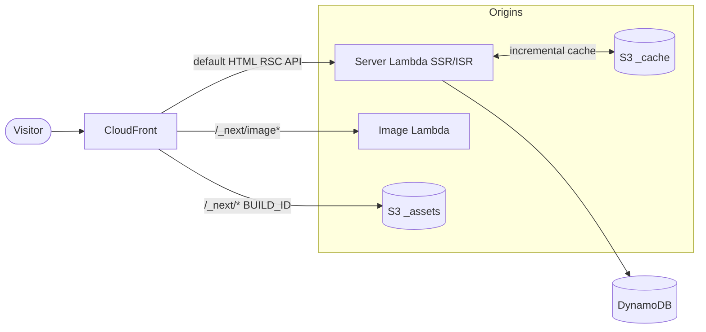
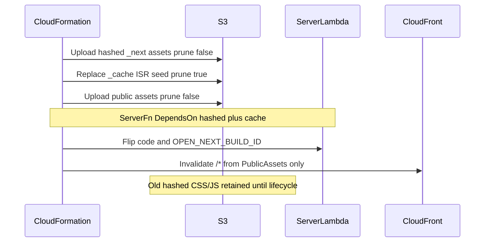

# Architecture — OpenNext on Lambda + CloudFront

How the public site (`apps/web`) and admin (`apps/admin`) are hosted. Stack
inventory lives in the [README](../README.md#aws-infrastructure-cdk-stacks);
this doc covers request routing, cache headers, and deploy ordering.

Both apps use the shared CDK construct
[`NextjsSite`](../packages/infra/src/constructs/nextjs-site.ts).

## Request routing

CloudFront sits in front of three origins: the streaming server Lambda (HTML,
RSC, API, ISR), the image-optimization Lambda (`/_next/image`), and an S3
bucket that holds hashed static assets under `_assets` and the ISR seed under
`_cache` (not publicly routed).

| Behavior path    | Origin                     | Notes                                     |
| ---------------- | -------------------------- | ----------------------------------------- |
| `default` (`/*`) | Server Lambda Function URL | ISR pages, RSC, route handlers            |
| `/_next/data/*`  | Server Lambda              | Same as default                           |
| `/_next/image*`  | Image Lambda               | Sharp-based optimizer; reads `_assets`    |
| `/_next/*`       | S3 (`_assets` origin path) | Hashed CSS/JS and other Next static files |
| `BUILD_ID`       | S3                         | Build marker file                         |

## Asset classes and cache headers

OpenNext’s fingerprinted-asset model: HTML may be briefly stale; hashed CSS/JS
must never 404.

| Object                                    | Cache-Control                                                     | S3 prune               | CloudFront invalidate                     |
| ----------------------------------------- | ----------------------------------------------------------------- | ---------------------- | ----------------------------------------- |
| `_assets/_next/**` (hashed CSS/JS)        | `public,max-age=31536000,immutable`                               | never (`prune: false`) | never (hashed upload has no distribution) |
| `_assets/*` except `_next` (public files) | `public,max-age=0,s-maxage=31536000,must-revalidate`              | never (`prune: false`) | `/*` on public upload                     |
| HTML / RSC (Lambda)                       | `s-maxage=10, stale-while-revalidate=50` via web `expireTime: 60` | n/a                    | covered by public `/*` invalidation       |
| `_cache/**` (ISR seed)                    | not on the CDN                                                    | yes (`prune: true`)    | none                                      |

Both asset uploads use `prune: false` because a second deploy to the shared
`_assets` prefix with `prune: true` would delete `_next/**`. Unused hashed
objects under `_assets/_next/` expire via a 30-day S3 lifecycle rule (re-PUT
on each deploy refreshes `LastModified` for the current build).

The web app sets `expireTime: 60` in [`apps/web/next.config.ts`](../apps/web/next.config.ts)
so Next does not default to ~1 year of `stale-while-revalidate` on ISR
documents. Admin is `force-dynamic` and does not need that knob.

## Deploy sequence

1. New hashed CSS/JS land in S3; previous hashes stay.
2. ISR seed in `_cache` is replaced.
3. Unhashed public files upload; CloudFront invalidates `/*` (documents and
   public paths — safe because hashes remain on S3).
4. Server Lambda flips to the new `BUILD_ID` only after hashed assets and the
   cache seed exist (avoids new-HTML / missing-new-CSS and sticky 403s).
5. Returning visitors with old HTML still load old CSS (200). New visitors get
   new HTML + new CSS after invalidation.
6. After 30 days, unused hashes expire.

Distribution custom error responses for 403/404 use TTL 0 and do **not** map
to `index.html` (that SPA fallback is Storybook-only).

## Runtime flows (apps and packages)

The diagrams above are **hosting**: CloudFront origins, cache headers, deploy
order. For how a request or scheduled job moves between `apps/*` and
`packages/*` — including **files to open when it is broken** and **which
CloudWatch log group / `service` field to query** — start at
[docs/flows/](flows/README.md). Job ingest is
[docs/flows/job-ingest.md](flows/job-ingest.md).

## Why hard refresh used to be required

The previous `AssetsDeployment` used `prune: true` and invalidated `/*` on
every deploy, which deleted previous-build CSS/JS from S3 and CloudFront.
Meanwhile ISR HTML carried Next’s default ~1-year `stale-while-revalidate`, so
browsers kept serving documents that linked to deleted hashes → unstyled pages
until a hard refresh. Retaining immutable hashes and capping document SWR
closes that race.
