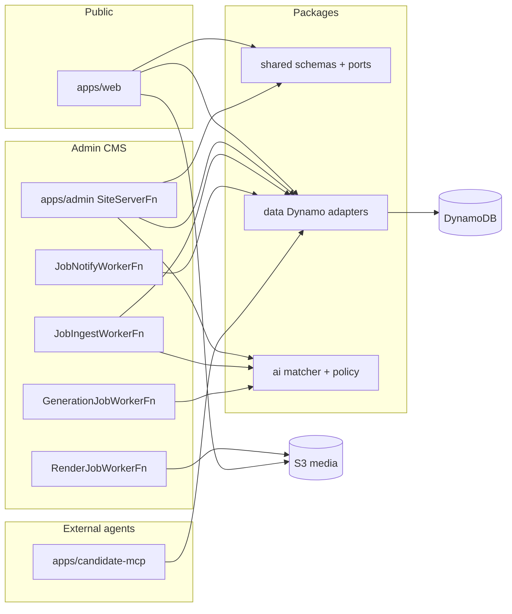

# Runtime flows

Maps of how work moves between apps and packages, plus **where to look
when something breaks**. Hosting and CDN details stay in
[`architecture.md`](../architecture.md). Decisions stay in
[`docs/adr/`](../adr/).

Region is **eu-west-1**. Prod log level on web/admin Lambdas is **WARN**
(ADR 0002): `logger.info` does not appear. Candidate-mcp is **INFO**. The
symptom alarm is **`Portfolio/Observability` / `AppErrors`** on dashboard
**`Portfolio-overview`**, fed by `{ $.level = "ERROR" }`.

## How the pieces connect



Apps never import AWS SDKs. Persistence goes through ports in
`packages/shared/src/ports`, implemented in `packages/data`.

## How to open logs

1. CloudWatch → **Log groups** → search `Portfolio-Admin`, `Portfolio-Web`, or
   `CandidateMcp` plus the construct in the table below (CDK names look like
   `Portfolio-Admin-JobIngestWorkerFnLogs…`).
2. Or Lambda → function name contains the construct → **Monitor → View
   CloudWatch logs**.
3. Logs Insights (JSON Powertools lines):

```
fields @timestamp, service, message, error.message, error.stack
| filter level = "ERROR"
| sort @timestamp desc
```

INIT crashes (bundle throws before the handler) are **not** Powertools JSON.
Search `@message like /Uncaught Exception/ or @message like /INIT_REPORT/`.

| Construct (search)          | `POWERTOOLS_SERVICE_NAME` / `service`            |
| --------------------------- | ------------------------------------------------ |
| `SiteServerFn` (Admin)      | `portfolio-admin`                                |
| `JobIngestWorkerFn`         | `portfolio-admin-job-ingest-worker`              |
| `JobNotifyWorkerFn`         | `portfolio-admin-job-notify-worker`              |
| `GenerationJobWorkerFn`     | `portfolio-admin-generation-job-worker`          |
| `GenerationJobDlqHandlerFn` | `portfolio-admin-generation-job-dlq-handler`     |
| `RenderJobWorkerFn`         | `portfolio-admin-render-job-worker`              |
| `RenderJobDlqHandlerFn`     | `portfolio-admin-render-job-dlq-handler`         |
| `SiteServerFn` (Web)        | `portfolio-web`                                  |
| `RebuildCanonicalPdfFn`     | `portfolio-web-rebuild-canonical-pdf`            |
| Candidate-mcp `ServerFn`    | `portfolio-candidate-mcp` (set in code, not env) |

## Flows

| Flow                        | Doc                                          |
| --------------------------- | -------------------------------------------- |
| Job ingest + 85+ email      | [job-ingest.md](job-ingest.md)               |
| Morning digest + follow-ups | [job-notify.md](job-notify.md)               |
| Admin job table / HITL      | [job-tracker.md](job-tracker.md)             |
| Admin Google sign-in        | [admin-auth.md](admin-auth.md)               |
| Resume / cover generation   | [resume-generation.md](resume-generation.md) |
| Tailored PDF + public PDF   | [resume-pdf.md](resume-pdf.md)               |
| Public site chat            | [public-chat.md](public-chat.md)             |
| Contact form                | [contact.md](contact.md)                     |
| Candidate MCP               | [candidate-mcp.md](candidate-mcp.md)         |
| CMS save → public site      | [cms-content.md](cms-content.md)             |
