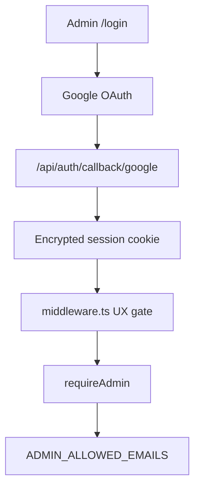

# Flow — admin Google sign-in

Better Auth + Google. Dynamo has **no row-level security**; every mutation
must call `requireAdmin()`. Middleware is UX only.

## Diagram

## Modules

| Step        | File                                                       |
| ----------- | ---------------------------------------------------------- |
| Guard       | `apps/admin/src/lib/auth-guard.ts`                         |
| Session     | `apps/admin/src/lib/auth/session.ts`                       |
| Better Auth | `apps/admin/src/lib/auth/index.ts`                         |
| Allowlist   | `apps/admin/src/lib/admin-emails.ts`                       |
| Auth routes | `apps/admin/src/app/api/auth/[...all]/route.ts`            |
| Secrets     | `/portfolio/google-oauth`, `/portfolio/better-auth-secret` |
| CI emails   | GitHub variable `ADMIN_ALLOWED_EMAILS`                     |

## Debug these files

1. Redirect URI mismatch — Google console vs `APP_ORIGIN` /
   `https://admin.…/api/auth/callback/google`.
2. Signed in but mutations 401 — email not in allowlist; `requireAdmin`
   on the action, not only middleware.
3. Auth 500 — `GET/POST /api/auth failed` in
   `apps/admin/src/app/api/auth/[...all]/route.ts`.

## Logs

Admin **`SiteServerFn`**, `service` = `portfolio-admin`. Message
`GET /api/auth failed` / `POST /api/auth failed`. Do not log cookies or
tokens.
