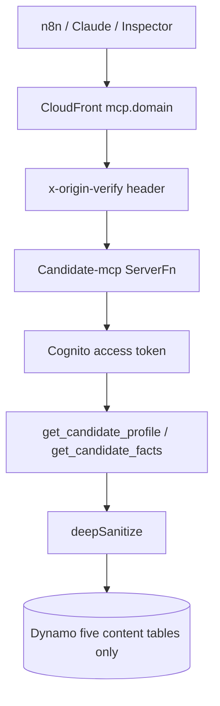

# Flow — candidate MCP (external read-only profile)

Network MCP on `mcp.<domain>`. OAuth 2.1 + Cognito. Tools are read-only and
`deepSanitize`d. **Not** the job tracker (ADR 0003 / 0007). Local
`packages/agent-mcp` is a different, unauthenticated dev server.

## Diagram

## Modules

| Step     | File / ADR                                                       |
| -------- | ---------------------------------------------------------------- |
| Stack    | `packages/infra/src/stacks/candidate-mcp-stack.ts`               |
| Handler  | `apps/candidate-mcp/src/lambda.ts`                               |
| Sanitize | `apps/candidate-mcp/src/sanitize.ts`                             |
| IAM      | `grantCandidateMcpDataAccess` — do not add `job-posting`         |
| Auth     | ADR [0006](../adr/0006-candidate-mcp-oauth.md)                   |
| Demo     | [`docs/n8n-candidate-mcp-demo.md`](../n8n-candidate-mcp-demo.md) |

## Debug these files

1. 403 from CloudFront — origin-verify header missing (raw Function URL).
2. 401 WWW-Authenticate — token / PRM; Cognito app client.
3. Empty tools — IAM or `DATA_BACKEND`; still must not grant job table.
4. SSRF — never add a caller-supplied URL fetch.

## Logs

Search Candidate-mcp **`ServerFn`**. `service` =
`portfolio-candidate-mcp` (hard-coded in `audit-log.ts`; the Lambda env
does not set `POWERTOOLS_SERVICE_NAME`). Log level is **INFO** (unlike
web/admin WARN). Timeout is 10s. No `reservedConcurrentExecutions`
(account unreserved floor is 10).
