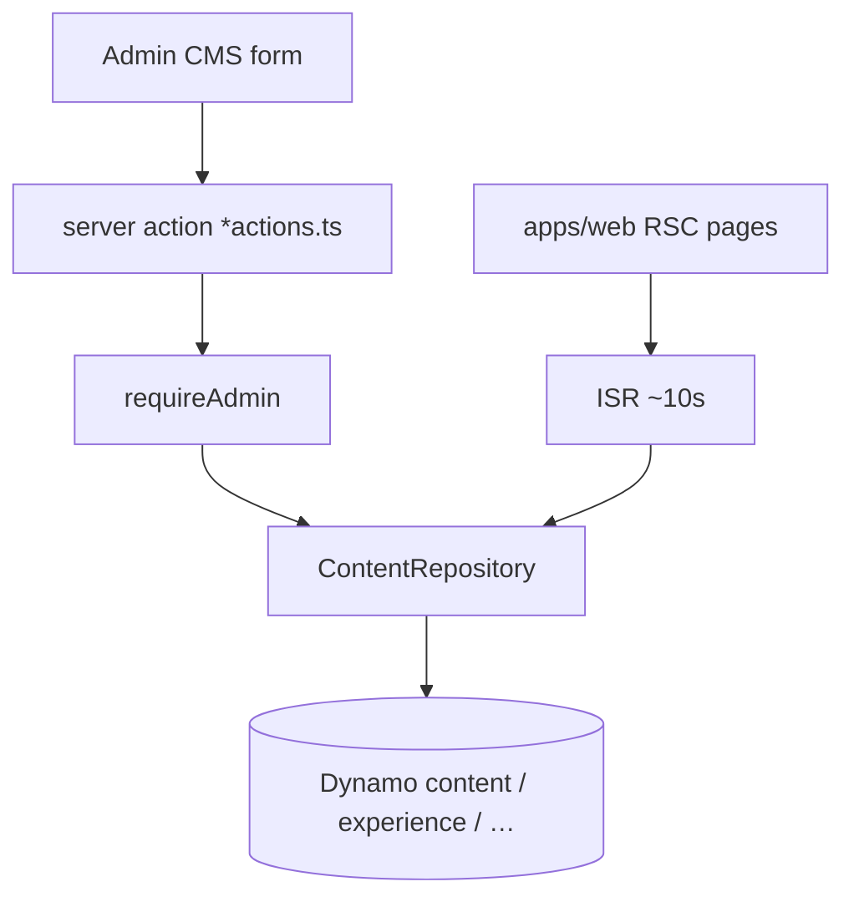

# Flow — CMS save to public site

Admin writes Dynamo via ports. Public site is time-based ISR (~10s), not
tag revalidation.

## Diagram

## Modules

| Step        | File                                                           |
| ----------- | -------------------------------------------------------------- |
| Guardrail   | `apps/admin/src/lib/authorization-guardrail.test.ts`           |
| Actions     | `apps/admin/src/lib/actions.ts`, `media-actions.ts`            |
| Adapter     | `packages/data/src/adapters/multi-table-content-repository.ts` |
| Schemas     | `packages/shared/src/schemas/`                                 |
| Public read | `apps/web` pages + `getContentRepository()`                    |

## Debug these files

1. Save 401 — [admin-auth.md](admin-auth.md).
2. Conflict toast — `ContentConflictError` / revision.
3. Public page stale > ~10s — ISR `expireTime`, not a missing SNS invalidation.
4. Parse errors after deploy — Dynamo omitted nulls vs Zod `.nullable()`
   (same class as job preferences).

## Logs

Admin **`SiteServerFn`** for saves (`portfolio-admin`). Web **`SiteServerFn`**
for render errors (`portfolio-web`).
