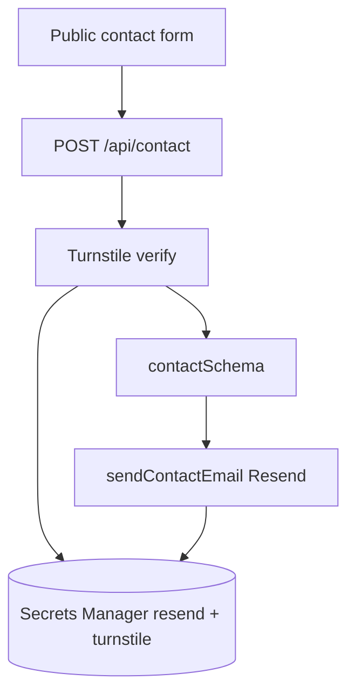

# Flow — contact form

Turnstile (bot) → Resend email. Same Resend secret as job-match mail.

## Diagram

## Modules

| Step    | File                                                           |
| ------- | -------------------------------------------------------------- |
| Route   | `apps/web/src/app/api/contact/route.ts`                        |
| Send    | `apps/web/src/lib/send-contact-email.ts`                       |
| Schema  | `packages/shared/src/schemas/contact.ts`                       |
| Secrets | `/portfolio/resend-api-key`, `/portfolio/turnstile-secret-key` |
| From/to | GitHub vars `CONTACT_FROM_EMAIL`, `CONTACT_EMAIL`              |

## Debug these files

1. “Not configured” — missing Resend or Turnstile secret / from address.
2. Verification failed — Turnstile site key vs secret, hostname allowlist.
3. Send failed — domain not verified in Resend; `contact form email failed`.

## Logs

Web **`SiteServerFn`**, `service` = `portfolio-web`.

`contact form email failed`, `contact form submission failed`.
