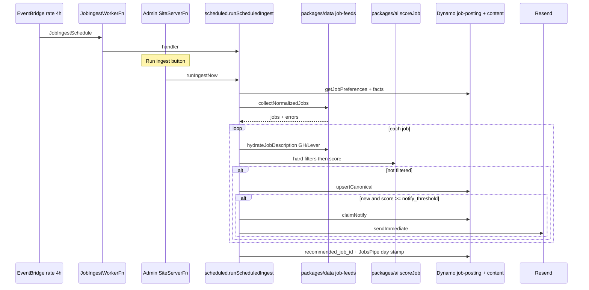
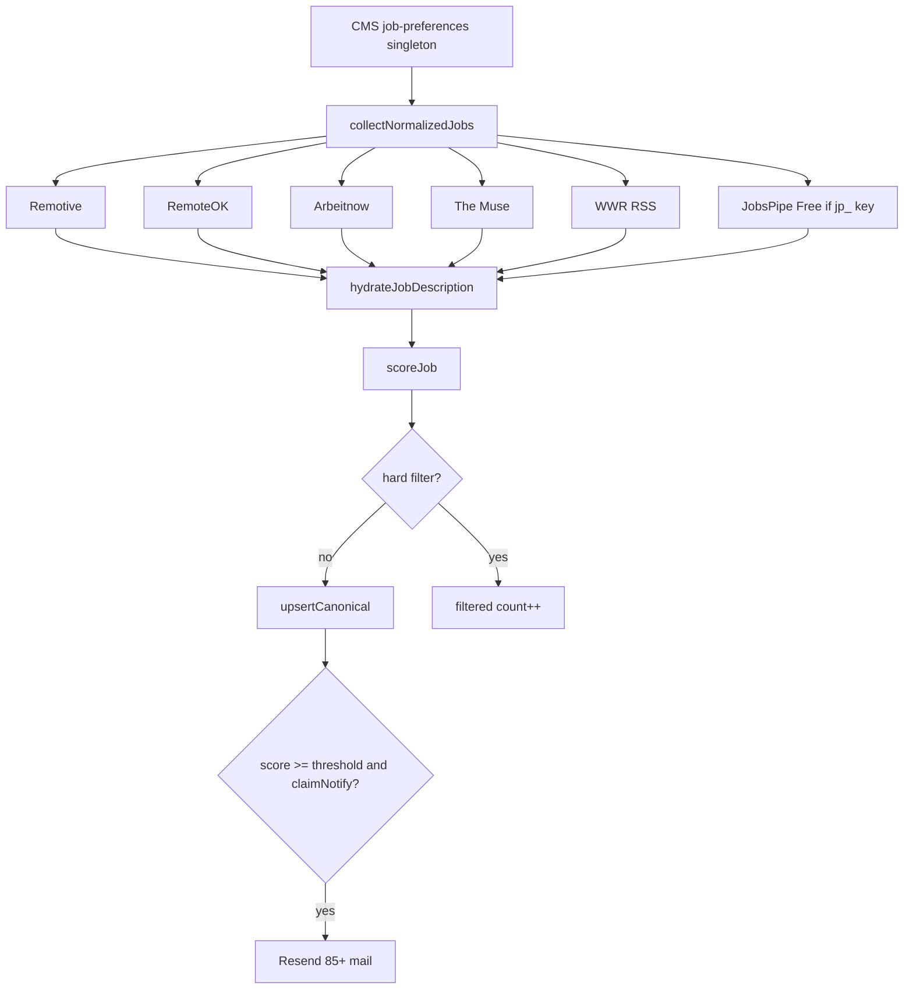

# Flow — job ingest (feeds → match → persist → 85+ mail)

EventBridge every **4 hours**, or **Run ingest** in admin. One sequential
walk of free boards + optional JobsPipe Free, scored against CMS prefs +
portfolio facts, upserted into `portfolio-job-posting`. New rows at or
above `notify_threshold` (default 85) email immediately.

This is **not** the job table HTTP API. `GET /api/jobs` is the tracker
([job-tracker.md](job-tracker.md)). Spec:
[`specs/job-match.md`](../../specs/job-match.md), ADR
[0007](../adr/0007-job-match-pipeline.md).

## Two entry points, one orchestrator

Scheduled ingest runs in **`JobIngestWorkerFn`**. The admin button runs
the **same** `runScheduledIngest()` inside **Admin `SiteServerFn`**. Logs
live in different groups depending on who kicked it off.

The worker must **never** import `next/*` (that caused the INIT crash:
Client Component / `next/cache`). Use
`load-candidate-facts-uncached.ts`, never `load-candidate-facts.ts`.



## Pipeline inside `runJobIngest`



## Modules

| Step                       | Package / file                                                   |
| -------------------------- | ---------------------------------------------------------------- |
| Schedule                   | `packages/infra/src/stacks/admin-stack.ts` (`JobIngestSchedule`) |
| Worker entry               | `apps/admin/src/lambda/job-ingest-worker/index.ts`               |
| Manual trigger             | `apps/admin/src/lib/job-actions.ts` `runIngestNow`               |
| Orchestration              | `apps/admin/src/lib/jobs/scheduled.ts` `runScheduledIngest`      |
| Pipeline                   | `apps/admin/src/lib/jobs/run-ingest.ts`                          |
| Collect / parse / JobsPipe | `packages/data/src/job-feeds/collect.ts` + `parse-*.ts`          |
| ATS hydrate                | `packages/data/src/job-feeds/hydrate.ts`                         |
| Score + hard filters       | `packages/ai/src/matcher/score-job.ts`                           |
| Prefs schema               | `packages/shared/src/schemas/job-preferences.ts`                 |
| Facts (worker-safe)        | `apps/admin/src/lib/resume-ai/load-candidate-facts-uncached.ts`  |
| Persist                    | `packages/data/src/adapters/dynamo-job-board-repository.ts`      |
| Mail                       | `apps/admin/src/lib/jobs/send-job-email.ts`                      |
| Recipients                 | `apps/admin/src/lib/jobs/secrets.ts` `jobMailRecipients`         |

## Debug these files

1. **INIT / `Uncaught Exception` / Client Component** — worker import graph.
   Start at `job-ingest-worker/index.ts` and `scheduled.ts`. Must import
   `load-candidate-facts-uncached.ts`, never `load-candidate-facts.ts`
   (`next/cache`). Guardrail:
   `apps/admin/src/lib/lambda-worker-imports.test.ts`.
2. **Handler ERROR after INIT** — `run-ingest.ts`. Per-source failures log
   `job ingest source failed` (ingest continues). A thrown error is
   `job ingest worker failed` (cron) or `manual job ingest failed` (button).
3. **Empty inbox** — prefs hard filters in `score-job.ts` (title family,
   seniority, remote, salary floor, recency), or feeds returning nothing.
   JobsPipe is skipped unless the secret starts with `jp_` / `jp_live_` and
   has not already run today (`jobspipe_last_search_date`).
4. **No 85+ email** — GitHub variable `CONTACT_EMAIL` becomes Lambda env
   `CONTACT_TO_EMAIL` (plus `CONTACT_FROM_EMAIL`). Secret
   `/portfolio/resend-api-key`. `claimNotify` no-ops if `notified_at` is
   already set. `mailTransport()` returns null when either piece is missing.
5. **Zod on prefs** — missing Dynamo nulls: `toJobPreferences` in
   `packages/data/src/adapters/multi-table-content-repository.ts`.

## Logs

| Who ran it         | Log group search     | `service` field                     |
| ------------------ | -------------------- | ----------------------------------- |
| EventBridge / cron | `JobIngestWorkerFn`  | `portfolio-admin-job-ingest-worker` |
| Admin button       | Admin `SiteServerFn` | `portfolio-admin`                   |

Look for:

- `job ingest worker failed` — worker catch (cron path)
- `manual job ingest failed` — admin button path
- `job ingest source failed` — one feed/parser failed; others still ran
- `job ingest notify failed` — persist succeeded, Resend threw
- `GET /api/jobs failed` is **not** this flow (that is the tracker UI)
- `Uncaught Exception` + `Client Component` = INIT, not a feed error
- `job ingest complete` is **INFO** — invisible on admin (WARN)

```
fields @timestamp, service, message, error.message, error.stack
| filter service = "portfolio-admin-job-ingest-worker"
    or message like /job ingest/
| sort @timestamp desc
```
