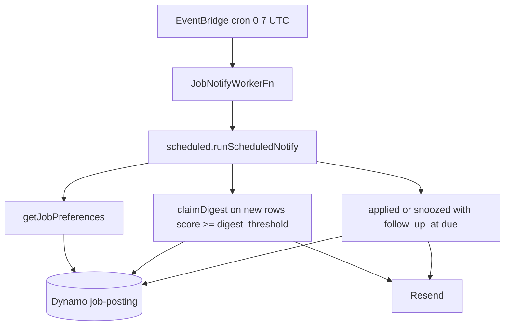

# Flow — job notify (digest + applied follow-up)

EventBridge **cron 07:00 UTC**. Separate Lambda from ingest. Emails new rows
at or above digest threshold (default 70) once, and snoozable 7-day
follow-ups for `applied` / `snoozed`.

## Diagram

## Modules

| Step        | File                                                             |
| ----------- | ---------------------------------------------------------------- |
| Schedule    | `packages/infra/src/stacks/admin-stack.ts` (`JobNotifySchedule`) |
| Entry       | `apps/admin/src/lambda/job-notify-worker/index.ts`               |
| Orchestrate | `apps/admin/src/lib/jobs/scheduled.ts` `runScheduledNotify`      |
| Logic       | `apps/admin/src/lib/jobs/run-notify.ts`                          |
| Mail        | `apps/admin/src/lib/jobs/send-job-email.ts`                      |
| Recipients  | `apps/admin/src/lib/jobs/secrets.ts` `jobMailRecipients`         |

## Debug these files

1. Same **INIT / next/cache** class as ingest if `scheduled.ts` pulls Next
   (notify imports the same module).
2. No mail: GitHub `CONTACT_EMAIL` → Lambda `CONTACT_TO_EMAIL`, plus
   `CONTACT_FROM_EMAIL`, `/portfolio/resend-api-key`. `mailTransport()`
   returns null when either piece is missing.
3. Digest empty: scores below `digest_threshold`, or `digested_at` already set.
4. Follow-up silent: status not `applied`/`snoozed`, or `follow_up_at` in the
   future (`status-machine.ts`).

## Logs

Search **`JobNotifyWorkerFn`**. `service` =
`portfolio-admin-job-notify-worker`.

Messages: `job notify worker failed`, `job digest email failed`,
`job follow-up email failed`. Success `job notify complete` is INFO (hidden
in prod).
