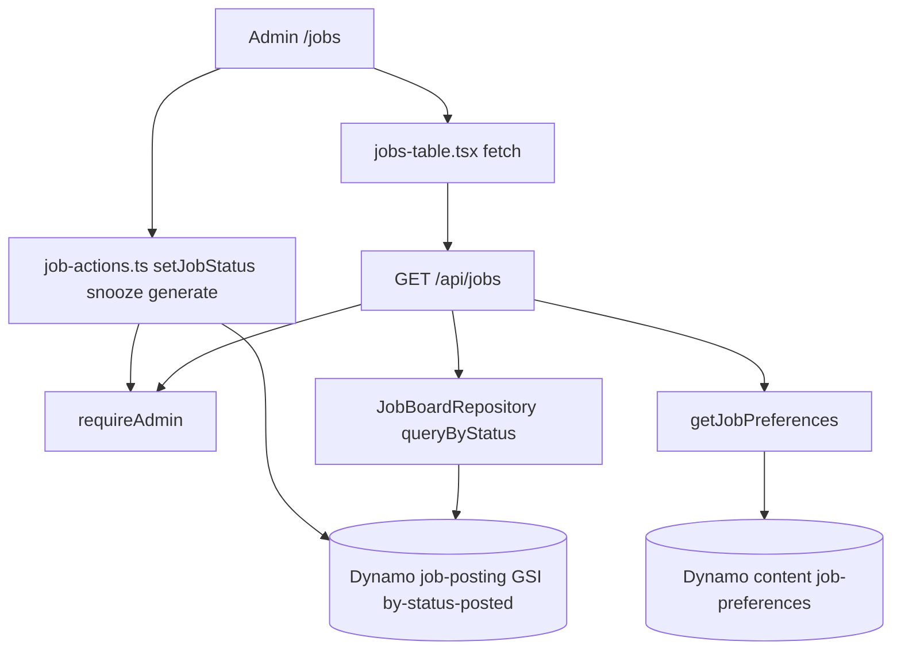

# Flow — job tracker (admin list, detail, HITL)

Human review of ingested jobs: virtual table, status machine, one-click
resume/cover/recruiter enqueue. Does **not** scrape; it only reads Dynamo.

## Diagram



## Modules

| UI / API     | File                                                     |
| ------------ | -------------------------------------------------------- |
| Table        | `apps/admin/src/app/(dashboard)/jobs/jobs-table.tsx`     |
| List API     | `apps/admin/src/app/api/jobs/route.ts`                   |
| Detail       | `apps/admin/src/app/(dashboard)/jobs/[id]/page.tsx`      |
| HITL actions | `apps/admin/src/lib/job-actions.ts`                      |
| Status rules | `apps/admin/src/lib/jobs/status-machine.ts`              |
| Prefs form   | `apps/admin/src/app/(dashboard)/(main)/job-preferences/` |
| Schema       | `packages/shared/src/schemas/job-posting.ts`             |

## Debug these files

1. **500 on `/api/jobs`** — `route.ts` logs `GET /api/jobs failed`. Usually
   `getJobPreferences()` Zod (absent Dynamo nulls) or GSI
   `by-status-posted` missing. Mapper:
   `multi-table-content-repository.ts` `toJobPreferences`.
2. Empty table, ingest healthy — status filter, or ingest never persisted
   (`run-ingest.ts`).
3. Cannot move status — `canTransition` in `status-machine.ts`.
4. One-click generate does nothing — generation queue / worker (see
   [resume-generation.md](resume-generation.md)).

## Logs

**Admin `SiteServerFn`**, `service` = `portfolio-admin`.

```
fields @timestamp, message, error.message, status, path
| filter message like /api\/jobs/ or message like /unhandled admin/
| sort @timestamp desc
```

Do not use `JobIngestWorkerFn` for this 500 — that Lambda does not serve
HTTP.
