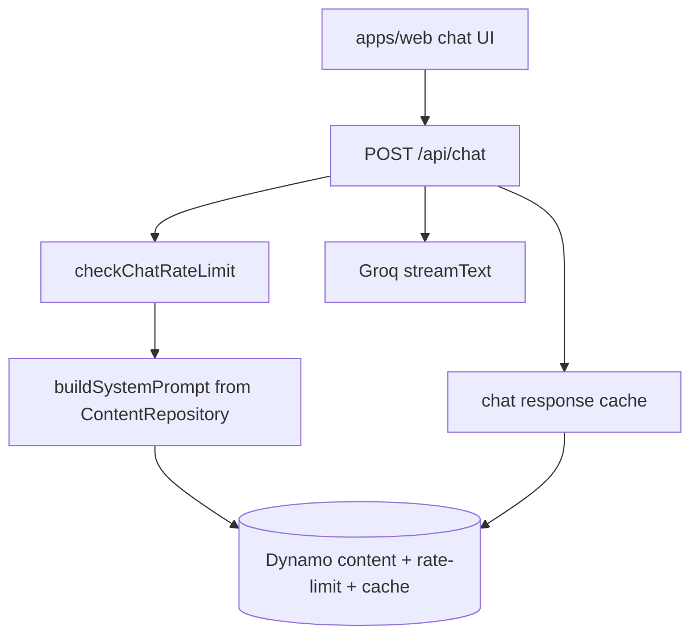

# Flow — public site chat

Visitor talks to the portfolio assistant. System prompt is built from CMS
content. Groq via the model factory. Rate-limited; first-turn cache optional.

## Diagram

## Modules

| Step       | File                                             |
| ---------- | ------------------------------------------------ |
| Route      | `apps/web/src/app/api/chat/route.ts`             |
| Rate limit | `apps/web/src/lib/chat-rate-limit.ts`            |
| Prompt     | same route + `@portfolio/data` content           |
| Injection  | `packages/ai/src/guardrails/prompt-injection.ts` |
| Keys       | `GROQ_API_KEY_SECRET_ARN` / `@portfolio/ai`      |

## Debug these files

1. 503 “not configured” — Groq secret empty (`failed to load Groq API key`).
2. 429 — chat rate limit or provider rate limit (WARN, not always ERROR).
3. Wrong bio in answers — CMS content / `buildSystemPrompt`, not the matcher.

## Logs

Web **`SiteServerFn`**, `service` = `portfolio-web`.

Messages: `chat api failed`, `chat stream failed`, `failed to load Groq
API key from Secrets Manager`. PostHog: `chatApiError` events.
