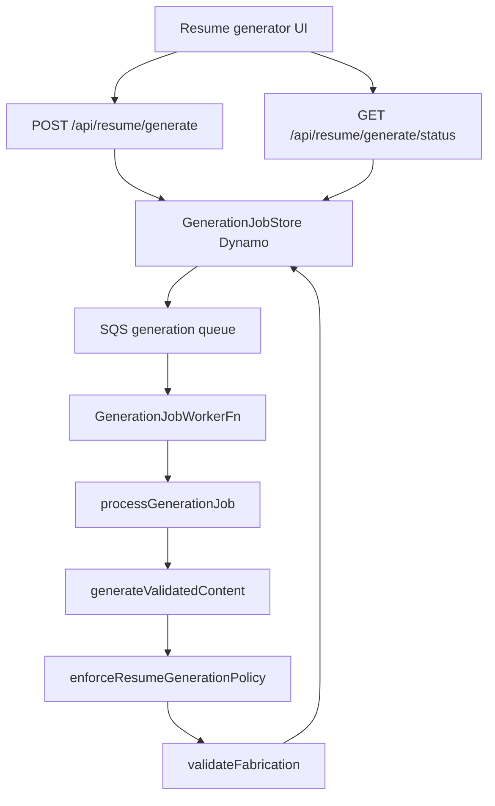

# Flow — resume / cover letter generation

Admin enqueues a job; an SQS worker calls the model, then **policy +
fabrication** before anything is stored. Never surface raw model JSON.

## Diagram

Local/fixture with no queue processes inline via `processGenerationJob`
(still the same function).

## Modules

| Step           | File                                                         |
| -------------- | ------------------------------------------------------------ |
| HTTP enqueue   | `apps/admin/src/app/api/resume/generate/route.ts`            |
| Worker         | `apps/admin/src/lambda/generation-job-worker/index.ts`       |
| Job runner     | `apps/admin/src/lib/resume-ai/process-generation-job.ts`     |
| Model + guards | `apps/admin/src/lib/resume-ai/generate-validated-content.ts` |
| Policy         | `packages/ai/src/policy/`                                    |
| Fabrication    | `packages/ai/src/guardrails/`                                |
| Facts (worker) | `load-candidate-facts-uncached.ts` — **not** `next/cache`    |
| Spec / evals   | `specs/resume-ai.md`, `packages/ai/src/evals/`               |

## Debug these files

1. 401/429/402 on enqueue — auth, rate limit, daily USD cap
   (`cost-cap.ts`).
2. Job stuck `queued` — SQS, worker INIT (same `next/cache` class as
   ingest), or `generation job worker failed for message`.
3. `FACT_VALIDATION_FAILED` / policy — eval case under
   `packages/ai/src/evals/cases/`, prompts in `packages/ai/src/prompts/`.
4. DLQ — `generation-job-dlq-handler` marks the job failed.

## Logs

| Surface | Search                      | `service`                                    |
| ------- | --------------------------- | -------------------------------------------- |
| Enqueue | Admin `SiteServerFn`        | `portfolio-admin`                            |
| Worker  | `GenerationJobWorkerFn`     | `portfolio-admin-generation-job-worker`      |
| DLQ     | `GenerationJobDlqHandlerFn` | `portfolio-admin-generation-job-dlq-handler` |

Messages: `validated resume generation enqueue failed`,
`generation job processing failed`, `inline generation-job processing failed`.
