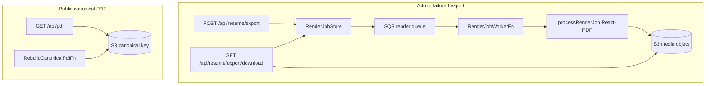

# Flow — tailored PDF export and public canonical PDF

Two pipelines: **admin async render** (SQS worker, React-PDF) and **public
`GET /api/pdf`** (cache in S3, optional scheduled rebuild).

## Diagram

## Modules

| Step          | File                                                           |
| ------------- | -------------------------------------------------------------- |
| Export API    | `apps/admin/src/app/api/resume/export/route.ts`                |
| Render worker | `apps/admin/src/lambda/render-job-worker/index.ts`             |
| Render runner | `apps/admin/src/lib/resume-ai/process-render-job.tsx`          |
| Download      | `apps/admin/src/app/api/resume/export/download/route.ts`       |
| Public PDF    | `apps/web/src/app/api/pdf/route.tsx`                           |
| Rebuild       | `apps/web/src/lambda/rebuild-canonical-pdf/index.ts`           |
| Print spec    | `packages/ui/src/resume-pdf/`, `specs/resume-ats-react-pdf.md` |

## Debug these files

1. Export 422 — policy / numeric claims in `export/route.ts`.
2. Status never `ready` — render worker logs, DLQ handler.
3. Download 500 `JOB_ARTIFACT_MISSING` — S3 object gone; message
   `render job marked ready but object is missing`.
4. Public PDF wrong layout — `pickDefaultResumeLayout`, CMS default layout.

## Logs

| Surface       | Search                  | `service`                             |
| ------------- | ----------------------- | ------------------------------------- |
| Export HTTP   | Admin `SiteServerFn`    | `portfolio-admin`                     |
| Render worker | `RenderJobWorkerFn`     | `portfolio-admin-render-job-worker`   |
| Public PDF    | Web `SiteServerFn`      | `portfolio-web`                       |
| Rebuild       | `RebuildCanonicalPdfFn` | `portfolio-web-rebuild-canonical-pdf` |

Web messages: `resume pdf generation failed`, `canonical resume pdf cache
read/write failed`.
